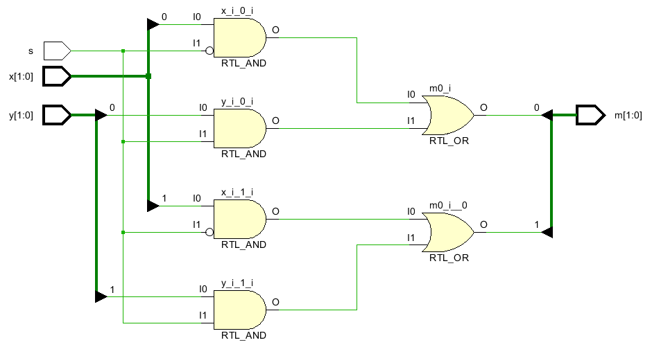
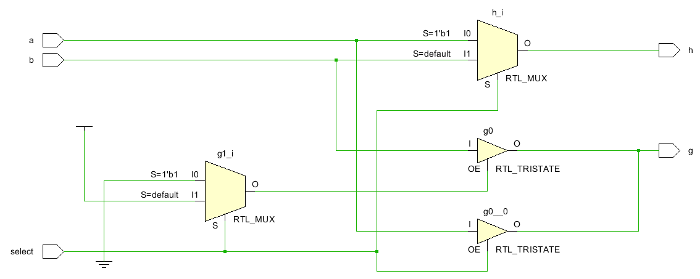
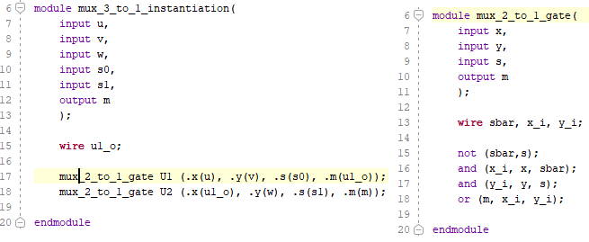

# Mux
[Inspiration for this lab](https://www.xilinx.com/support/documentation/university/Vivado-Teaching/HDL-Design/2015x/Verilog/docs-pdf/lab1.pdf)

Vivado turns all circuits into the primitives of a CLB Slice: LUTs, muxes, carry-logic, xor gates, d flip flops. Understanding these is the goal of this course. We have covered XOR gates and LUTs. The goal now is to cover muxes. 

## 1_1_m2x1Mux-1bitwide

#### Port Diagram

#### 

#### Verilog Code

#### RTL Schematic Screen shot

#### Synthesis Schematic Screen shot

#### Implementation Device screen shot zoomed in on something interesting

#### Testing

SW[0] is x, SW[1] is y, SW[2] is the select line and LED[0] is the output m. SW[2] selects SW[0] or SW[1] and connects it to the LED. 

#### **Questions**/Tasks

*In the rtl schematic screen shot, the two **and gates** are connected to select and not select. Describe what they are doing in terms of what a mux does?* **The top gate is not select and bottom is select hence the two given gates make a mux with the or gate at the end which is the choosing result. **

*In the rtl schematic screen shot, what does the **or gate** do in terms of what a mux does?*

**Choosing one of the gates to be the resulting output.**

*How does the schematic change after running synthesis?* **It shows what vivado thinks of or a summary of what is meant to be created in visual diagrams.**

*After running synthesis and implementation, clicking on synthesis under RTL, synthesis and Implementation continues to display the LUT based diagram. Not the gate based diagram. Why? Form a reasonable, non-trivial, relevant hypothesis.* **The lut is the table that in general form represents what goes into the circuit from left(inputs) and what exits(outputs), showing general form of the circuit with the mux inside of a lut.**

 *The black and white design window appears first after running which step of the workflow?* **During Implementation**.

*How what can you click on to see a region of the device window change from some color to white?***By opening up the device schematic and clicking on any part of the device.**

*White arrows in the screen shot above are helping us see what?***Inputs and outputs**

*How does Data flow in the fpga from left to right, right to left, bottom up, top down?***Data is received for the two x and y switches and switch s is the determining switch to which result will be the output m.**

*What is the verilog symbol for the white line going up at an angle in the device diagram?*

**It is represented by an arrow.**

## lab1_1_mux2-1-2bitwide

#### Port Diagram

#### Verilog Code

#### RTL Schematic Screen shot

#### Synthesis Schematic Screen shot

#### Implementation Device screen shot zoomed in on something interesting

#### Testing

One select line now selects between two pair of inputs and displays one of the pairs on LEDs. 

#### Questions/Tasks

*Explain how to zoom in on the above Device Screen Shot.***Either scrolling or click and drag to make a box on the screen shot**

*Do you see pictures of muxes in the Device Screen Shot? Are they used?* **Yes, they are inside of the Lut.**

*Which stage of the work flow choose the specific LUT above?***It should be the Show Cell Connections.**

*Which stage of the work flow chooses the green lines?***It is called routing resources.**

*What do the white lines represent?* **Wires**

*What do the spots where white lines cross represent?***Intersection or split between the wires.**

## lab1_2_mux2-1-tristate

### Port Diagram

#### Verilog Code

#### RTL Schematic Screen shot

#### Synthesis Schematic Screen shot

#### Implementation Device screen shot zoomed in on something interesting

#### Testing

Two muxes are implemented using the same inputs with the same select line.  So if the two are equal, their outputs should be equal.  SW[0]- a , SW[1]-b,  SW[2]-select, outputs are the first two LEDs. 

#### Questions/Tasks

*In the RTL schematic, what is RTL_Mux g1_i doing?***Making sure that the switch is set to either zero or one(?)**

*Which of the two verilog implemented muxes actually created a tristate symbol in the RTL schematic?***It should be the g1-i mux.**

*After Synthesis, which of the two verilog implemented muxes looks more simple?***Bottom g1-i mux**

*After Synthesis, why hasn't Vivado detected that the two circuits are identical?***B/c they have different input/outputs**

*After implementation, does the schematic change? If so, put a screen shot here.***No**

*Do the insides of the device reflect the schematic .. after implementation?***Yes**

*What are the truth tables of the one or two LUT(s)? Put a screen shot(s) here.*

Lut 1:

Lut 2:

*Are the truth tables the same or different? Why would Vivado do this? Is this a bug in Vivado?***Yes, no they are suppose to be the same b/c inputs represent the same values.**

*Do some tests modifying this project. Can you make the one line of code mux into a 4 input, 2 select line, 1 output mux in one line?***It is possible as shown below in the picture.**

## lab1_2_tb_mux2-1-2bitwide

The screen shots and port diagrams above are not going to be done for you. For the rest of the semester, you are to supply the missing diagrams. For example, starting with the RTL screenshot, everything through testing is missing. Describe how to test this circuit. **Crop the screen shots**!

**x[0] and x[1] represent value of 0 in the two muxes while y[0] and y[1] represent the value of 1 for input into the mux, thus the s switch will make the lights bright when no turned on for x values and turned on for y values.**

### Port Diagram

#### 

#### Verilog Code

#### Simulation Screen Shot

#### RTL Schematic Screen shot

#### Synthesis Schematic Screen shot

#### Implementation Device screen shot zoomed in on something interesting

#### Testing

The two inputs x[1:0] are controlled by the switch s which will light output m[1:0] if both on and s is off. On the same note, the y[1:0] inputs will be controlled by s when it is on which will turn m[1:0] on if both switches of y are on or either one for one LED in order.

#### Questions/Tasks

*tb stands for what?***Test bench**

*What verilog code is the top level module, the test or the circuit?***top level module**

*The verilog code shares the same port interface as the previous 2bit wide circuit. How is the verilog code different?***The new code now groups x[1:0] together as well for y switches for ports 0 and 1 in order. The 2bitwide would group x[0] and y[0] together for port 0. Also, it is much more shorter.**

*What name would you give to this verilog abstraction level?***It would be RTL language.***

*In the simulation, what is the cause of the red box with an X in it above?* **It might be because of a instant reaction to the switches being set to 0 within the program.**

*In the simulation, what do the green boxes with numbers in them mean?***Those mean whether the switch is on or off.**

*In the simulation, was all the activity captured or are their changes to the left of the yellow vertical line?***Yes, all the activity was captured in the left of yellow line, the rest is the continuation of the behavior from before.**

*Is this simulation associated with RTL, Synthesis or Implementation Vivado analysis?***This is associated with RTL.**

*Is this a physics simulation or logic simulation?***This is a logic simulation**

*Can the previous, port-interface identical, circuit be simulated without test verilog code?***Yes it can be simulated.**

*If it can be, take a screenshot of the Simulation and compare with this one.*

*If it can't be simulated, take a screenshot of the error message and form a hypothesis of what it is trying to tell you in your own words.***Seems to not be functional because of a lack in test code.**

**Look at this line of code**. It has a module name and then () with nothing in them. 

*Where does the test get it's input?* **It is within the parenthesis.**

*Where does it's output go?***That is also within the parenthesis after the inputs.**

**The next questions** are about this line of code: 

*Which circuit above has the same format of three instructions separated by a space?* **It is kind of similar to mux tristate circuit.**

*Does the first section refer to the circuit or the test itself?***It refers to the circuit**

*DUT stands for Device Under Test. Can this name be changed?***It can be changed to different names**

*What were some of the names used instead of DUT in the circuit above?* **I think it would be referred to as LUT or EUT.**

*What is the purpose of it?* **To determine where the test of the circuit would start to take place.**

**The .x(x) format** is different than the circuit above when calling a module. [Suppose this article](http://verilog.renerta.com/mobile/source/vrg00027.htm) is the first you find that describes what is going on. 

*What are the keywords you searched for to find a better article?* **Circuit port inputs and outputs  instantiations explanation**

*What is it's URL?* 

[]: http://www.asic-world.com/verilog/syntax2.html	"Ports"

*Is this technique limited to test verilog code or can it be synthesized?* **It can also be synthesized**

**The following questions are about this code block:**

*Is the word "end" the end of the "begin" or the end of initial?* **The end of begin**

*Why isn't there a semi-colon after "end"?***That would cause an error**

*Are the commands under begin executed sequentially or in parallel?***They are executed sequentially**

*Are all the possible combinations of x, y and s tested?* **No, only some are tested**

*How many combinations of x,y and s are there?***27**

*Is there a reason that the #20; is intended?***It might be b/c of the loop to stop at order 20.**

*Does white space matter in verilog?***No it doesn't in most cases**

**Read these articles** ... about using initial: [argument](https://forums.xilinx.com/t5/Design-Methodologies-and/quot-initial-quot-statement-with-quot-output-quot-variables/td-p/485782), [pro](http://billauer.co.il/blog/2018/02/verilog-initial-xst-quartus-vivado/), [con](https://www.quora.com/Why-are-initial-blocks-synthesizable-in-FPGA-and-not-in-ASIC), . 

*Which article supplies the most evidence?***Pro seems to be the most informative.**

*Which article is merely opinion?***Con seems to be mainly opinion based**

*Which merely says it is possible?***Argument says that it is possible.**

*What concept is the initial concept linked up to ... that we haven't discussed?* **Clocks and memory**

*Make up a rule for yourself regarding using verilog initial command now. You can change in the future. What is this rule?*

**Bigger Picture**

Here are some answered questions that you may have.
*Are there ways to write a verilog test that creates messages such as "pass" or "fail"?* **Yes**
*Are there ways to create verilog loops in the test that cycle through all x,y and s combinations?* **Yes**
Is writing a test in verilog different than creating a circuit in verilog? **Yes**
Are verilog commands used to create tests not synthesized by vendors? **Yes**

Now answer these questions:

*Do you want to learn how to write verilog to test this stuff, or something like java, c++ or python to test?***I want to learn how to make verilog show different behaviors, meaning the bigger picture.**

**Even Bigger Picture**

**4***Does the above test actually test with the Vivado implemented FPGA physics or merely test the Verilog logic?* **Verilog Logic.** 
**2***Does Vivado try to communicate physics or logic to you through "Open Synthesized Design", "Open Implemented Design"?* **Physics**
**3***Is there a way to build a circuit to test a circuit and put them both in an FPGA?* **Yes**
**1***Is there a way to collect data about a circuit in FPGA RAM and then dump it to a PC to test?* **Yes .. Is built into Vivado called ILA (integrated logic analyzer)**

*Please rank the above questions by putting a number in front of the with 1 being what you would like to learn first, and 4 being what you would like to learn last .. given that we are working with small circuits.*

*Which of the test methods is more appropriate for a very large project like a CPU?***The last question in my opinion.**

## lab1_3_mux2-1-1bitwide-reg

### Port Diagram

#### Verilog Code

#### RTL Schematic Screen shot

#### Synthesis Schematic Screen shot

#### Implementation Device screen shot zoomed in on something interesting

#### Testing

The two switches x and y are moving to ports 1 and 0 in order within the mux while the switch s controls which will turn on LED m by being on or off when either of inputs are on. 

#### Questions/Tasks

*This circuit is similar to which previous circuit?***It is very similar to mux 1bitwide.**

The @* is the clearest indication of verilog evolution and the difference between system verilog and regular verilog. Here is a summary. Later we will read the [Cliff Cummings, SunBurst paper](http://www.sunburst-design.com/papers/CummingsSNUG2016SV_SVLogicProcs.pdf) paper on this topic. 

​	always @(y,x) .. too many mistakes, hard to read code ..
​	always @(\*) .. any variable on the right hand side of an equal sign
​	always @\* ..  since 2001 .. just forget the parenthesizes

*Why is there so much verilog code using old forms of the always command on the internet?***It is to distinguish the lines of code in a big program and showcase the used symbols**

The always @* can not reference a clock. There is no clock in our circuit. It is combinational logic.  One can tell it is combinational logic by looking at the = sign in the begin/end code.  This means that it is executed in sequence .. at near the speed of light. 

*reg stands for what?***It stands for register inside of the circuit which keeps track of the information being moved around.**

*What is m driven by in the previous similar circuit?***It is driven by wires**

*What is a reg m driven by in this circuit .. when just looking at the verilog code?* **It is driven by switch s and changes applied to it.**

*How is the RTL Schematic of this circuit different the pervious similar circuit?***It is actually shown in mux form instead of multiple logic gates.**

A reg typically uses a D-flip flop inside an FPGA slice. *Do you see any evidence in the schematic or in the device itself of the reg?***It should be the wire O moving to m.**

Reg without a clock is called a latch. Vivado hates latches. It goes to extremes to eliminate latches.
Read through the Messages this circuit generates.  *Does any message say it is not creating a reg?***It talks about no clocks being found in user design!**

This verilog code is described by Vivado tutorials as at the behavioral abstraction level (..a good thing.. above RTL abstraction level). *What is good about it since the reg was essentially ignored?***The reg without clock will take time off the process therefore slowing down the circuit test.**

*Given that RTL programming involves reg, is it a requirement that RTL verilog coding cause the use of an FPGA CLB's D-flip flop?***Yes**

*Which verilog code is more "C" like, this code or the previous similar circuit?* *Why?***This code since it includes if/else as well as initial end and always for conditions**

This mux can be [implemented with one line of code](https://github.com/ENES-246DigitalElectronics/ENES246/blob/master/-5MuxOfMux/m2x1Mux/m2x1Mux.srcs/sources_1/new/m2x1mux.v):  assign m = s ? x : y; 
*Why isn't this talked about above? Why isn't this given the name RTL verilog or Behavioral verilog?***Because it always behaves one way and that is it.**

## lab1_3_mux2-1-2bitwide-reg

The simple mux circuits explored in this lab were created with various forms of the if then else command above. The single line of code is **if else** short hand. But it can not grow larger muxes. But what does a larger mux mean? There are two answers to that question explored below. 

### Port Diagram 

#### Verilog Code

#### RTL Schematic Screen shot

#### Synthesis Schematic Screen shot

#### Implementation Device screen shot zoomed in on something interesting

#### Testing

The two inputs y[1:0] are connected to port 0 while x[1:0] are connected to port 1 and controlled by switch s within the mux. Meaning while switches x[1:0] are on, only s can make the m[1:0] LEDs to turn on and vice versa.

#### Questions/Tasks

*How is this code different from the previous project?***The ports have switched places.**

Circuits get large several ways. One way is doing many things in parallel.  Parallel is like herding cattle .. the goal being a couple of horses and dogs guiding cattle. Here in select line is guiding the path of 2 cows. *Re-write this code to guide 64 cows.* **It is done by changing inputs to [63:0] and having 6 select lines.**

Another [single line of code that synthesizes](https://github.com/ENES-246DigitalElectronics/ENES246/tree/master/-5MuxOfMux/m16x4MuxRTL) a mux is:  assign m = i[s]; 
where i[0]=x and i[1]=y. This scales from having 2 inputs on two wires and 1 select line one wire, to 32 inputs with 5 select lines ... a bigger mux rather than multiple copies of the same mux. *How many select lines would be needed to choose one of 128 cows?* **7 select lines.**

*Begin [reading this document](https://web.stanford.edu/class/archive/ee/ee371/ee371.1066/tools/verilog_tips.pdf) and then answer this question .. Is it worth trying to create a design tool that can create multiple copies and grow larger at the same time?* **No, since it will take a big chunk of space.**

Answer the previous question from the big picture point of view, not from the (is it possible) point of view.  A mux is an old digital design concept. RTL is a new concept. Behavior modeling with verilog **if else** and **reg** is very similar to C. When learning to programming, was learning a mux a pre-requisite? **No.**  *Is it worth learning about a mux?* **Yes, it can replicate many logic gates.**

*What is the largest mux that would fit in a 6 input LUT?***It would be a 2 by 2 mux**

In the Implementation Device screen, there are pictures of a mux. *Why does vivado implement **if else** in a LUT when it has muxes in the configuration logic blocks (CLB)?* **The ports of lot need to be connected via the switch at bottom which activates with the if/else condition within the code.**

[Fast Carry Logic](https://www.xilinx.com/support/documentation/user_guides/ug474_7Series_CLB.pdf) speeds up any math the FPGA does. On page 42 there is this diagram: 

*When does vivado implement the CLB muxes?***When an RTL code is made without use of assign commands**

*Is fast carry logic a control path or data path concept?* **It should be a data path concept.**

## lab1_4_2-mux2-1inSequence

One of the ways we know what is going on is to predict Vivado's behavior. This circuit uses two select lines, but only selects between 3 inputs. Normally two select lines chooses between four inputs. So this is not quite a mux. 

### Port Diagram

#### Verilog Code

#### RTL Schematic Screen shot

#### Synthesis Schematic Screen shot

#### Implementation Device screen shot zoomed in on something interesting

#### Testing

u,v,w are inputs to two muxes, with u and v on ports 0 and 1 and switch s0 corresponding to first mux and that wire connected to port 0 of 2nd mux, along with w on port 1 and switch s1 corresponds to the LED light m being on or off.

#### Questions/Tasks

*Which of the two modules above is the top level module?***The left side module**

*What is the symbol for top level module in the vivado design sources hierarchy?***TLD(?)**

*Which of the two modules above has nets (wires) mentioned in the XDC file?***The left side module**

What are the lower level module instantiation names? **U1 and U2**

*What in the XDC file is the wire ul_o connected to?***It is connected to the LED or m**

Do an experiment.  Change the .x, .y, .z and .m order in the instantiation. *Does the code still produce the same RTL schematic?***No, it gives an error due to the inputs and outputs being changed.**

Do another experiment. Remove .x, .y, .s and .m along with the parentheses () in the module instantiation, **but keep the original order that matches the instantiated module**.  *Does this code still produce the same RTL schematic?***No, it is not be the same schematic.**

Think about a big project. You start off writing the smaller modules and testing. Then you write larger and larger modules. The larger modules call the smaller modules. Two very different larger modules may re-use the same smaller module.  Port Interface drawings keep track of the net names, but not the order defined in the lower module. Mapping higher module net names to lower module net names means having to know what order they were originally in .. in the lower module.  *Which of the above net mapping techniques between modules makes it only necessary to map wire names, not order?***Port Interface drawing.**

*Does the RTL schematic show the two instantiated modules?* **Yes, it does.**

*What does the Plus sign mean?***It stands for reg or in this case, the wiring**

How does the synthesized schematic change? **It combines everything into one module instantiation.**

*How many LUTs does the synthesized schematic indicate will be used?***Just 1 lut**

*After implementation, does the schematic change?***No, not really.**

The LUT has 5 inputs and a truth table of all their possible combinations.  *Where is this truth table in the Vivado interface (hint: netlist)?***It is within netlist, cell properties in full screen**

*Take a screenshot of the truth table and put it here.*

*Find where I4, I3, .. I0 are mapped to the top level input nets. Put the screen shot here.*

*Is there any order to the mapping?***Yes, there seems to be order within the inputs.**

 

## Ethics

These ethics questions are related to the community of engineers working for industry, working for Xilinx, and working to teach about this subject.  Together they have to create standards.  Verilog is called a standard by the IEEE.

*Describe the success of the verilog standard.***It is a breakthrough in the industry of engineering  and technology since it made it much easier to code hardware programs and keep on adding and fixing the giant program.**

*Do you think the IEEE, the largest, international, engineering standards organization, lays down law that Engineers world wide have to follow?* **No, the laws are a result of actions deemed necessary by engineers worldwide.**

*Are engineers involved with precise, universally known best practice that hasn't changed for over 100 years or are technicians?* **No, they innovate.**

*Why are there all these different ways of implementing a mux in verilog when vivado turns them all into the same thing .. a LUT?* **Different ways will make engineers get used to new approaches within the coding part of a mux.**

*If there is one good, true way of implementing a mux in verilog, why not just teach/learn that?***There is a way to write the entire mux into one short line of code but people must also know how it got to this way of finding the answer.**

*Given the chaos of the verilog standard, does this excite you as an engineer with visions of an opportunity?  Does it give you visions of a job reducing the chaos, unexplored cracks where there are possible significant improvements in productivity, possible unknown territory that the standard hasn't addressed? Or does it depress you?***It makes me excited that new inventions and improvements can be made from such a simple language.**

*What does chaos feel like?***It doesn't feel good, but it is the necessity to keep the engineers going.**

*Describe the tremendous advantages a fresh young mind has when confronted with chaos.* **The fresh mind may have new and much more simpler solutions to the given problems.**

*Having learned about a chaos, visualize the advantages one has when confronted with one of these opportunities:  .. getting a doctorate, working for Xilinx or using Xilinx tools in a competitive engineering company.* 

*Given that Fortran hasn't changed since the 1960's, C hasn't changed since the 1970's. Java and C++ haven't changed for [decades](https://www.tiobe.com/tiobe-index/), do these languages excite you as an engineer or depress you?***They are necessary in life but not as exciting as a bridge to new improvements.**

Almost all software today has verilog code generators including matlab, python, Lab View. A lot of this code will pass Simulation on [EDAplayground](https://www.edaplayground.com/) or will only work with specific hardware.  *What are the chances that generated code will work in Vivado?* **The chances are very high since vivado likes the RTL way of writing the code.**

*How universal is the digital design process, how universal are the design documents and the symbols they contain that are entered into and looked at in matlab, python and LabView?***They are known pretty much all over the world.**

*What is the market share of [Xilinx](https://www.fool.com/investing/2018/04/17/xilinxs-project-everest-looks-like-bad-news-for-in.aspx)?* **Xilinx has 58% share of FPGA which is interesting and to see how they are moving up in the world.**