# Lab 10-101(Mealy Sequence Detector)

### RTL Schematic:

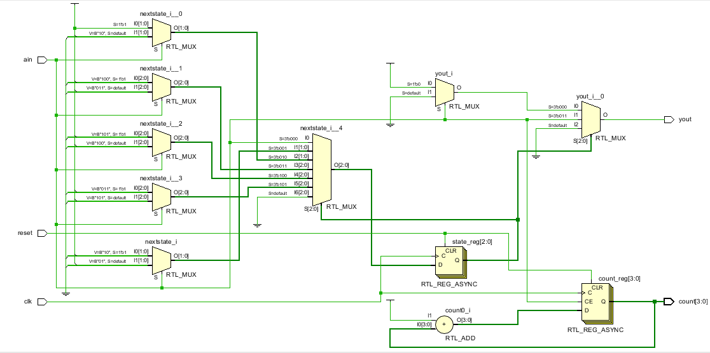

### Something Interesting of Implement:

# 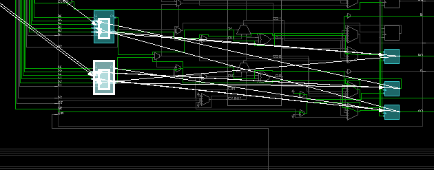

### Verilog:

Snippet of where the states are named and assigned

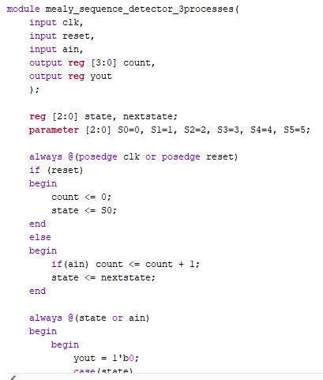

### Testing:

There are three inputs of ain,clock, and M18 button of reset which resets the entire circuit. The LEDs output yout will be on at the start and when ain is turned on with each flip of clock, after 3 switches, the yout will turn on and count will increment in terms of binary value for up to 4 binary bits. yout is described to be 1 in case of states S0 if ain is zero and S3 if ain is on. That says why the yout comes on every 3 clock switches. The following is how the states are made:

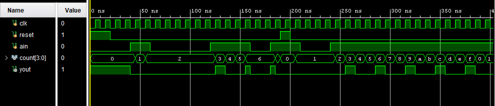

 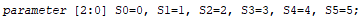

#  Lab 10-201(Moore Sequence Detector)

### RTL Schematic:

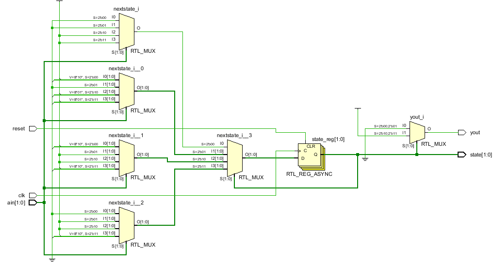

### Something Interesting of Implement:

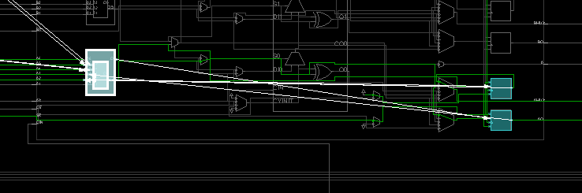

### Verilog:

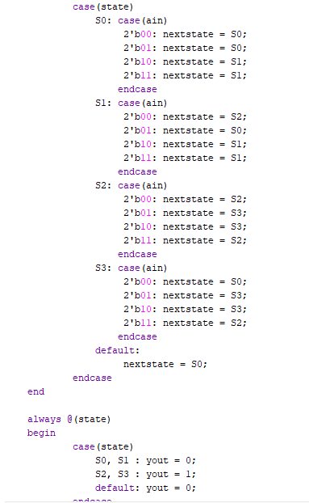

### Testing:

There  are four inputs one being reset button at M18 which zeros the circuit. The three others are ain[1:0] and clock which turn different states on by switch of the clock. S0 and S1 states turn yout output off while S2 and S3 turn yout LED on. The following is the instruction of how it is working:

 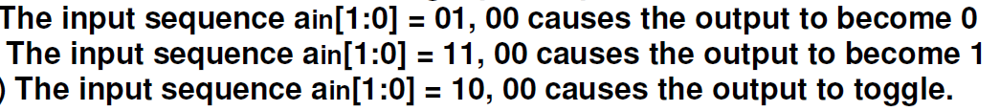

# Lab 10-301(Counts Counter)

### RTL Schematic:

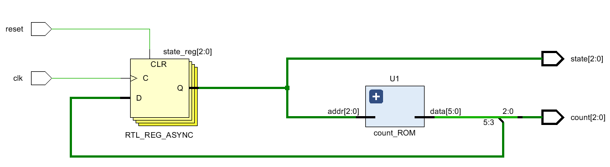

### Something Interesting of Implement:

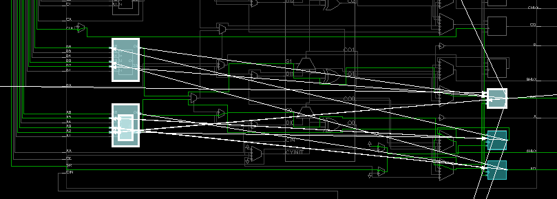

### Verilog:

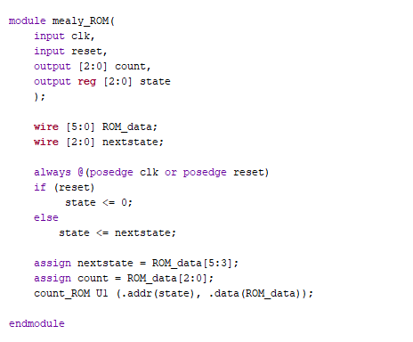

### Testing:

There are two inputs of clock which will be activating the sequence and reset which resets the whole process back to zero. Count[2:0] shows the LEDs counting based on the given sequence after each clock switch. and state[2:0] list the LEDs which show the state where the circuit is currently at. The following sequence is given which the program tends to follow in count_ROM module:

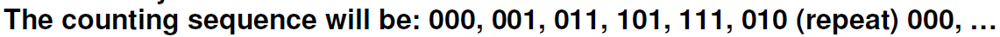

