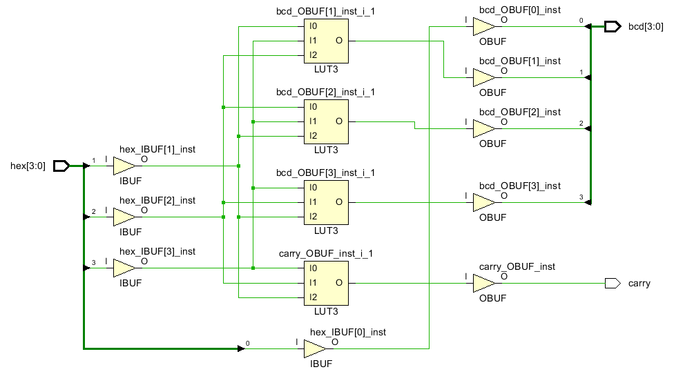
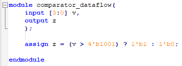
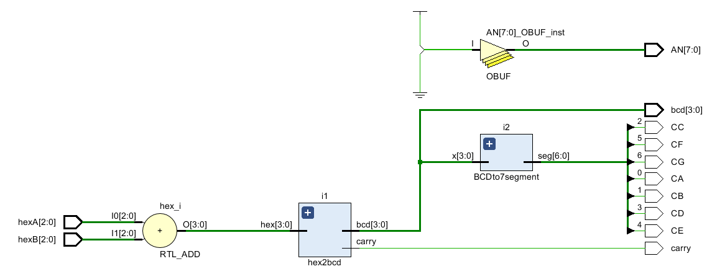

# Lab 2 7segment Display and Adders

Going to build a 7 seg display several different ways, then an adder, then a fast adder with fast carry logic and really use more of a CLB block than a LUT.

## Lab 2_0 Testing7SegDisplay

This lab is about turning off and on the individual red LED segments of the display, turning off and on the 8 displays on the Nexys4DDR board, and turning off and on the DP or decimal point. 

#### Port Interface

#### Verilog Code

#### 

#### RTL Schematic

#### Synthesis Schematic

#### Implementation Design Screen shot of something interesting

#### Testing

There are inputs called SW which represent the 16 inputs going into the gates. There are 17 LED lights, 8 An, 1 DP, and 7 C for outputs of the given circuit. Switches J15-R13 (SW[7:0]) are to change the display of the AN and DP. V8-V10 (SW[8:16]) will get rid of the segments on display meaning active high and when off is active low making the LED turn off and segments to turn on. Different numbers can be made from playing with these switches according to knowing which does which.(mentioned in journal)

#### Prompts

*How is this project different from just hooking all the switches up to all the LEDs?***This project is connected to each segment of 7seg display which will actually show a number instead of just a LED.**

*This project does something different from an output point of view than just selecting an LED. What output does something different?***AN gets rid of the digit displays.**

*Can the decimal place (DP) be moved to a different display than the display the number is appearing on?***Yes, it is possible by simply deleting all digits except the desired one by using S[8:15].**

*Can all the displays display the same number once?***Yes, when on, they all will display the same numbers**

*Can the displays capture and store different numbers?***No, it is not possible.**

*How are the segments, the DP and the anodes behaving differently than the LED's?* **They have their own way of disappearing or showing a specific number.**

*How would you modify segment, DP and/or anodes to make them behave like an LED?***By getting rid of segments and only leaving the DP on and changing the anodes randomly.**

*Would this be more confusing or less confusing when looking at the verilog code?***It is not too confusing but a bit vague to understand what C and anodes actually do.**

*What words are used by computer and electrical engineers to describe this behavior?***SSD(?)**

*How many additional lines would have to be added to the XDC file (mostly commented out) to address each of eight displays, and each segment and decimal place on each display individually like the 16 LED's?* **Similarly 16 additional lines.**

*Are these the same number of additional wires that would be needed coming out of the FPGA?***Yes**

## lab2_1_bcdTo7Segment

Constants are typically easy in other languages. In circuit design, constants are used too often. A constant can have four values:

​	0
​	1
​	x unknown
​	z high impedance (tri-state)

### Syntax

Verilog is case insensitive when specifying constants. In general, Verilog is case sensitive. 

Vivado tries to get rid of constants and change z into x at some point in the workflow. 

Integers can be written like constants in other programs such as  +3 -21, but you have no control over the bit width.  Negative numbers are represented by a 1 in the most significant bit  (MSB). 

Constants can be specified at the bit level in this format:

​			**[size] 'base value** 

**size** specifies the number of bits,   
**base** is one of o or O (octal), b or B (binary), d or D (decimal), h or H (hexadecimal),   
**value** is a sequence of digits which are valid for the specified base. 

For example,
wire [4:0] 5'O37 			11111
reg [3:0] 4'B1x_01 		1x01   the underscore _ is considered white space here
wire [11:0] 7'Hx 		 	 xxxxxxx 

Your goal is to develop a circuit with four BCD bits coming in and 7 bits leaving to support a 7 segment display.

CA, CB, CC, CD, CE, CF, CG and DP (decimal place), are all wired in parallel to each of the 8 displays. There are only 8 wires going from any circuit to all 8 displays. The AN (anodes) turn the 8 displays off and on. there is one AN wire going to each of the 8 displays. AN wires are active low, meaning a 0 turns them on and a 1 turns them off. 

#### Port Interface

#### Verilog Code

This circuit has nothing to do with choosing which of the 8 segments are being used. Another circuit is going to have to do that. But we need to turn them off in order to test this circuit. 

The obvious solution in verilog doesn't use constants:

There is some logic behind this code. Look at the equation for seg(6) or g. Only three numbers turn off  segment g: **0, 1 or 7**,  **0001 or 0111**, (**~x[3] & ~x[2] & ~x[1]** ) |(**x[2] & x[1] & x[0]** ). 

Is this obvious to a electrical or computer engineer working in the field?  **Yes.** 

#### RTL Schematic

#### Synthesis Schematic

**(All these pictures are inside the lab folder)**

#### Implementation Design Screen shot of something interesting

#### Testing

There are 4 switches of x representing the 4 binary digits showing the number on 7 seg display. By working from 8-0 or x[3] to x[0], there will be digits displayed in response to that binary code.

#### Prompts

*Does the verilog code above use constants?* **I think the input x[3:0] is constant**

*Was the <u>obvious solution</u> obvious to you?* **No, it needed to be tested.**

*Did you see a verilog coding solution that was different than this one before looking at the code?***Yes**

*Did you understand the verilog code's logic above after reading it?* **Yes**

*Do these solutions blind you .. prevent you from seeing other solutions than the one above?* **Yes**

*BCD is easy compared to displaying in addition to 0,1,2,3,4,5,6,7,8,9 also displaying abcdEF of hex. Suppose you added support for hex in this project. Is this [scope creep](https://en.wikipedia.org/wiki/Scope_creep)?* **Yes it is.**

*What is normal? For an engineer to create/see a complicated solution, and revisit the project requirements to see if the project is out of scope? Or design a minimal, elegant solution that perfectly matches the design requirements the first time?* **Always creating a complicated solution is what engineers are required to do.**

*For seg[6] "g" , the first term is  (**~x[3] & ~x[2] & ~x[1]** ).  What BCD symbols (0,1,2,3,4,5,6,7,8,9)  is it creating a 1 for?* **1**

*For seg[6] "g" , the second term is  (**x[2] & x[1] & x[0]** ).  What BCD symbols (0,1,2,3,4,5,6,7,8,9)  is it creating a 1 for?* **7**

*Do these one's created for segment "g" of the display turn the g red LED off or on?***They turn it on.**

*If the circuit receives a hex B, what is going to be displayed on the seven seg display designed for BCD?***It would display a 6.**

*Find an alternative verilog solution to this project and link it up here.* 

[]: http://verilogcodes.blogspot.com/2015/10/verilog-code-for-bcd-to-7-segment.html	"BCDtoSSD"

*Is this project more beautiful, easier to understand, less work to figure out what is going on in the first place?* **Yes**

*Does the project you linked up use constants?* **No**

## Lab2_2_hexToBCD

#### Port Interface

#### Verilog Code

#### RTL Schematic

#### Synthesis Schematic

#### Implementation Design Screen shot of something interesting

#### Testing

This includes inputs of 4 called hex and outputs of carry and 4 bcd which will light up with the change of switches for hex. Starting from 1-8, if it goes to 10, 1 moves to carry and then numbers can be made until 15. 

#### Prompts

*A BEL is a [Basic Element of Logic](https://www.rapidwright.io/docs/Xilinx_Architecture.html).  Start reading the link. What is a routing BEL most similar to?*  **It is similar to mux**

*What are PIPs?***It configures a routing BEL to propagate a signal from inputs to outputs pins.**

*Can you see a PIP in the device Implementation screen shots above?***Yes**

*What company wrote RapidWright?***Xilinx**

*What value is RapidWright adding to Vivado?***Explanation of different concepts**

*Given that there are other products similar to RapidWright from the same company, what does this tell you about the way the company develops software?***They make reading tutorials about how the software works as well.**

*The always @\* means execute when anything on the right hand side of the equal signs changes. What is the only thing on the right hand side of the equal sign?***hex-10**

*Within the module the lines of code all execute in parallel. Within the always begin .. end block, everything executes in sequence like a normal program. There are two more begin end blocks associated with if and else. What would a line of code look like if there was no begin end block after always, after if or after else?***There would be only the first line being processed and not the rest of the lines**

This project was solved by a Xilinx instructor with the following four modules:

*Why would someone write code like this, when the simple verilog code actually used in this project  is possible?***To make the code understandable and self-explanatory.**

*There are other clues that this code is not RTL and old besides the heavy use of modules. What is it?***Assign within multiple lines of the codes**

*The RTL schematic is very interesting. It has a symbol for comparing and a symbol for subtracting. A normal gate is not used. What are the equivalent symbols in logisim? (Attach screen shots)

*Are there any standard symbols for comparing and adding circuits on the internet? Spend 1 minute, link up what you can find that is close to what looks like a standard.* **Yes**

[]: https://en.wikipedia.org/wiki/Electronic_symbol	"Symbols"

*Spend 1 minute reading this [link](https://blog.digilentinc.com/fpga-configurable-logic-block/) with the goal of figuring out the difference between a SliceL and LUT. Write a phrase to describe how you are going to remember the difference .. for now ... Doesn't have to be correct. It is a hypothesis that you carry around with you.***SliceLs are much bigger than LUTs where they hold up to 4 LUTs each and many D-flip flops**

## Lab2_3_hexTo7seg

The goal is to display BCD with an LED representing 1, the switches representing the original Hex, the LED representing 1 and the rest of the BCD number appearing on the 7 segment display.

#### Port Interface

#### Verilog Code

#### RTL Schematic

#### Synthesis Schematic

#### Implementation Design Screen shot of something interesting

#### Testing

There is 4 hex switches which will change the 7 seg outputs up to #9. The carry is accounted for BCD for saving the 10 from before results up until 15 with the LED lights which are hex as well. 

#### Prompts

*Why the modules HexToBCD and BCDto7SegDisplay?

*Why not make it just one big, simple verilog project?***To gain understanding of what each project does**

## Lab2_4_Adders

The goal talked about last lab and this lab is to see something besides LUTs and routers. The goal is to see Fast Carry Logic implemented in the FPGA. There are several design issues:

**User Interface ** 
The maximum number on eight, 7segment displays is 99,999,999. This is  28 bits  ‭0101 1111 0101 1110 0000 1111 1111 in binary (hex). 

​	1) What kind of math can we do with 16 switches that results in number between 0 and 0101 1111 0101 1110 0000 1111 1111? **By simply adding the two 3 switch hex digits by turning them on and off.**
​	2) Do we translate from hex to BCD first, then develop BCD math circuits to stay in BCD? Or do we stay in hex, develop hex math circuits and switch to BCD at the end? Is this for a bank or for a scientist?**We develop from hex to BCD and stay in BCD. This can be used for both a bank and a scientist.**
​	3) We can only see one segment at a time. We need a clock to switch between segments, in a circular fashion very fast. This way the segments look on, when really they are flashing.  But we haven't covered clocks yet. 

**Vivado LUTs and MUX solution**

 At what point does Vivado switch over from implementing with LUTs and Muxes into [Fast Carry Logic](https://www.xilinx.com/support/documentation/application_notes/xapp522-mux-design-techniques.pdf) .. the control logic below?   COUT stands for carry out. We can not implement the circuit below because we haven't covered clocks yet. 

Vivado is going to translate any math into truth tables.  A 6 input LUT can hold a 64 line truth table.  That leaves 22 bits requiring an additional 4,194,304 (4Meg) 6 input LUT's  and an identical number of 2 input, 1 select line muxes. 

**Design Choices**

Build 3 bit adder. Two groups of 3 switches, added together fit in four bits and can be displayed on one 7 segment display with an overflow or carry LED. 

#### Port Interface

6 hex inputs moving to a mux which will then be translated to 6 hex digits and one carry acting as BCD.

#### RTL Schematic

#### Synthesis Schematic

#### Implementation Design Screen shot of something interesting

#### Testing

The 6 hex switches are inputs which for first 3 and last 3 act as two different digits while the inputs are the hex LEDs and carry acting as BCD as well as SSD showing the addition of numbers.

#### Prompts

*Describe the changes to the previous project that turned it into an adder in terms of the verilog code.***There is a assign hex which shows the addition of hexA and hexB which is how they are added on SSD.**

*The maximum of adding two four bit numbers is 5 bits. We are already displaying the 5th bit on an LED. Why not implement a 4 bit adder? What is so complicated about implementing a four bit adder with BCD output ?* **It is difficult to keep track of higher numbers as they go higher.**

*There is [lots of information](https://www.xilinx.com/support/answers/53109.html) on the web about an older version(s) of Vivado and Vivado's predecessor. This information is misleading and should be avoided. How can you do this?***To test the program for ourselves.**

*On the internet, you can find half-adders, full-adders, look ahead adders,  3 bit adder designs in both verilog and with gates. Why are there are no adder truth tables?* **Because it can be random or way too large to have a truth table.**

*Create a 3 bit + 3 bit = 4 bit adder truth table and put it here. Suggest doing this with logisim, with a three bit adder, then have logisim analyze the circuit. Logisim will produce the truth table.*  

*How many LUTs would the logisim circuit consume, just for the purpose of adding?***It is 4 LUTS**

*What does Vivado change this circuit into LUTs?***To simplify the process into input and output system**

*Can you think of a more efficient way to use the LUTs than what Vivado did?***To create **

*How many rows would a 28 input truth table have?***I think it would be about 2^28 rows**

*How many LUTs are used in this project and how many are available in our FPGA (Look at Synthesis Utilization Report)?***Seems to be around 3 and there seems to be 12 in FPGA**

*What is the largest adder truth table that could be built with all of them (# of inputs, outputs, and rows) ?**I am not sure.**

*What are the chances that a four bit add with look ahead logic are going to implemented with LUTs by Vivado?***It is a very high chance.**

*Since fast carry logic is so important in speeding up math, what are the chances that Xilinx is going to use fast carry logic with verilog code containing 4 bit half adders, full adders and look ahead logic?***It is definitely a part of their schedule.**

*Vivado instead wants us to use it's Intellectual Property. Explore the IP Catalogue. What is the Xilinx IPs' name?* **IP integrator(?)**

*Is Vivado's math IP free?* **Yes**

*What are the maximum number of bits the Xilinx IP can add together?* **The max number is 9**

*Why does it require a clock?***To perform the addition faster and store in memory.**

*Is a clocked solution faster or slower than a LUT solution?***It is much faster**

## excetra

Verilog rules when array length on the left of the equal sign doesn't equal the array length on the right. 

If the size specified is larger than the value for the specified constant, the number is padded to the left
with 0’s except for the case where the left most bit is x or z then the padding is done with x or z. 

If the size specified is smaller than the extra leftmost bits are ignored. 

If the size is not specified then it will use 32-bit data.

