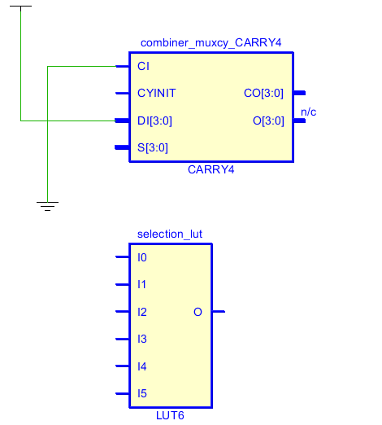
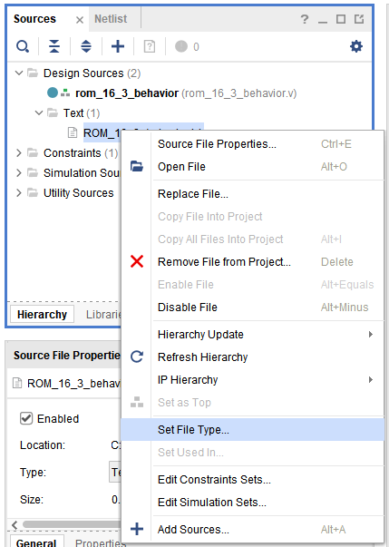

## 1Lut_Mux

One goal might be to use the primitives within the FPGA CLB. Chapter 3 of the Vivado 7 Series Libraries  lists off the primitives. Chapter 4 describes how to implement them using VHDL and Verilog. Explore the LUT and MUX in this project. 

#### Port Diagram

#### Verilog Code

#### RTL Schematic Screen shot

#### Synthesis Schematic Screen shot

#### Implementation Device screen shot zoomed in on something interesting

#### Testing

 The inputs are [2:0] data_in and [2:0] sel as well as muxcy_sel and muxcy_carry. The outputs are muxcy_data_out and lut_data_out. The hex number put inside the vivado code deteremines when the first LED or Lut output will be off or on at which numbers. 

___

#### Prompts

*Does it look like the primitives can be accessed in Verilog?* Yes, there is a connection between the given verilog primitives and diagram.

*Can you see a direct relationship between the primitive used and the primitive referenced in the Verilog code?*Yes, they are both showing the same picture except one is using buffers to help reduce of glitches.

*The Mux implementation leaf cell seems to highlight a vertical path within the CLB. Why?* These represent the switches which will be changing while going through the lut.

*How is the LUT instantiation different from the normal instantiation of calling a pre-existing module ?* It needs a code of hex digits describing how big the table is and when/ not to turn the LED on/off. (To make truth table)

*What Line of the Code puts a truth table in the LUT?*Line 9 initiates and until line 16, it specifies which inputs/outputs are suppose to be what within the table.

*How many rows are there to the truth table?* 64 rows.

*Look through chapters 3 and 4 of the Vivado 7 Series Libraries.  Focus on the Design Entry Method box.  Then answer these questions.*

*What does instantiation mean?* It means to move an existing module into the top module with a specific given name.

*What does inference mean?* An idea or conclusion drawn from evidence and reasoning.

*Have we inferred buffers (BUFG) in projects before?* Yes, it is done when doing mux which vivado creates buffers for to avoid problems.

*Verilog has tristate [buffer primitives](http://verilog.renerta.com/mobile/source/vrg00003.htm)  named bufif0 and bufif1. These names don't appear in the Vivado 7 series libraries. Why? What are the risks of using the buffers Xilinx has named in this document?*  The two buffers are used to correct common errors or problems within the circulation of current. Not having them as part of the library may cause several unnecessary glitches to the system.

*Look up LUT6 in the Vivado 7 series library document. We instantiated it in this project. Is Instantiation possible according to the document?* Yes, according to document, it can be any hex value but usually in lab used within the range of the given 16 digits.

*What is the preferred design entry method?* A method for a better, less error causing design to the verilog code.(?)

*Is MUXCY in the Vivado 7 series library document like LUT6?* Yes, it is.

*We instantiated MUXCY in this project's verilog code. And it looks like it was successfully implemented. We can test it. Read this [article](https://forums.xilinx.com/t5/Welcome-Join/where-are-the-muxcy-and-xorcy/td-p/311931) from from Jan 2013 about MUXCY and XORCY. Do you think it is wise to use this piece of a CLB in a circuit design project?* Yes, it is possible and will provide interesting results as carries to the LUT.

*What would you guess is the preferred entry method for a MUXCY .. if it existed in the Vivado 7 series library?* It would be used as a simple carry.

*Why do you think Xlinix still supports MUXCY (because we used it!), yet don't document it?* It can be useful to compute 1bit high speed carry functions.

*Xilinix was the [first FPGA vendor](http://hardwarebee.com/list-fpga-companies/) to start shipping LUT6 FPGAs. Intel FPGAs come from purchasing Xilinx's major competitor for years .. and ships a LUT6. How does [Flex-Logix](http://www.flex-logix.com/6lut-faster-denser/) fit into this competition?* They are a copy of Xilinx trying so hard to be the same as them.

*Why is this question important to you, the college, the market place?* It talks about the future of technology in logic designs and circuits.  

*What does [Flex-Logix name it's equivalent](http://www.flex-logix.com/dsp-applications/) of LUT6?* It is called Gen 2 EFLX.

*Is the code on this [web site](http://www.flex-logix.com/dsp-applications/) verilog or it's competitor VHDL?* The code is in verilog.

*What class at HCC teaches you what a [FIR](http://www.flex-logix.com/dsp-applications/) is?* It may be electric circuits-205.

## 2Decoder

#### Port Diagram

#### Verilog Code

#### RTL Schematic Screen shot

#### Synthesis Schematic Screen shot

#### Implementation Device screen shot zoomed in on something interesting

#### Testing

The three inputs of x each have a different binary code which the LED outputs of y and z follow; x[0] will make the lights to move left by 1, x[1] will make lights to jump two points to left, x[2] will cause the lights to move left by a space of 4. z follows y and whatever the y seems to do, z will do the same on its side. Starting bright LEDs count as zero for the circuit.

___

#### Prompts

*How many of the outputs of the Decoder are positive at any given instant in time?* Since it is a two output decoder, may have up to two positive at any time.

*When the Decoder changes it's output, what happens among these choices:*

1. *Do all outputs go to 0 before the next set of outputs are displayed?*  No
2. *Do the new 1(s) appear along with the previous 1(s) simultaneously?* Yes
3. *Does/Do the output(s) flicker in some unknown way based on impurities or differences in the fabric of the FPGA?* No
4. *Do we have the tools to figure out what the answer is?* Yes, it is based on the testing and verilog code	

*Given the concept of an [infinitesimal](https://en.wikipedia.org/wiki/Infinitesimal), is it ever possible for two outputs, from any circuit to change simultaneously?* No, there is always a nano second difference between the best possible scenerio outputs displayed.

## 3PriorityEncoder

A encoder is different than a mux in that there are no select lines. Only one input out of all the inputs coming in is expected to be a 1.  So what happens if more than one input is a 1? Priority is assigned. For example, which child of all your children get's your attention if all are yelling at you at the same time? You have to choose. 

In hardware, it is the outputs of other circuits that need attention. One circuit finished multiplying and the output needs to be transferred somewhere else so it can begin the next multiply. Meanwhile the keyboard circuit has taken the x and y coordinates, has detected the key is stuck, has stopped repeating the key, is beeping the user and needs to trigger software that displays a message on the screen "key stuck." Which takes priority if both are asking for CPU attention at the same time?   

To deal with more than one input, the designer has to deal with two issues:   
What is the priority order?

What is the difference between the 0 net of the bus having a 1 on it asking for priority and silence .. nobody asking for priority? 

It is a tricky, logic problem. Look at the first two rows of the truth table below. The first row is where none of the inputs are asking for attention. V=0 because Y1 and Y0 could be anything ... notice that the truth table is only 5 rows long. With four inputs, it could be 16 rows long. 

There four vivado projects. There are three different Verilog expressions introduced. The first synthesizable Verilog code has been introduced. Do one port interface diagram. Do four Verilog code screen shots and four screen shots of everything else. The goal is to compare them.  Just describe how the three test below.

#### Port Diagram (ALL THREE)

#### Verilog Code

#### RTL Schematic Screen shot

#### Synthesis Schematic Screen shot

#### Implementation Device screen shot zoomed in on something interesting

#### Testing

The inputs of [7:0] D are all the switches which will change the lights to 3 different encoders within the verilog code. As for the Ygates and Vgate outputs, it is shown in the code that a certain D[3:0] switches will turn them on/off when needed. As for the VdataFlow and YdataFlows, since the VdataFlow output is always on when the YdataFlows are off, when the D[7] switch is on, it will automatically turn off and change to YdataFlow LEDs which will continue to count high in binary code as shown in the verilog starting from left most switch to the right most. D[0] does not affect anything in this case. For last VoneHot and YoneHot outputs.

---

#### Prompts

*How is the gate verilog code different between AllThree and Gate?* It is in gate level coding.

*The first synthesizable System Verilog commands have been introduced. How can you tell by the source verilog file extension?* It has a .sv extension meaning that it is synthesizable. 

**Where in the verilog "new project sequence of steps" are you given the option of creating system verilog or just plane verilog?* When it asks for the design folder to either create or put in from another document.

*In what way does the DataFlow implementation use the if command?* It uses if command with the for loop when it is giving conditions to move through the loop for each counter, thus probably a latch.

*In AllThree, why would always @* work ... in addition to always_combo?* Always @ would be for a specific block of code when always_combo works on a different block with a combinations of variables and conditions.

*In System Verilog, what are the other two always commands?* simple always and always_ff...

*From a design point of view, which implementation of a priority encoder do you think Vivado expects engineers to ask it to implement?*  It would most likely ask for data flow RTL verilog code.

*Which implementation of a priority encoder looks like the easiest to spot and see within a much much larger chunk of verilog code?*  It would be the oneHot RTL code.

*Which is probably the most sustainable (will be supported by vendors in the future, future engineers looking at the code will understand it)?*  It will be the data flow code.

*Which will be the easiest to change/modify?* In my opinion it is the oneHot encoder.

*We have been told that implementation within the FGPA doesn't matter from a net and leaf cell count point of view. We don't see obvious controls that specify where within the chip everything is implemented. (It looks like resources next to the switch and LED pads are being used constantly.) But real quick in the future, speed is going to matter. Which of these priority encoder looks like it will be the fastest?* The faster one is the oneHot AGAIN!

*Why is speed not important to us right now?* We are trying to learn how each type of code works.

*Why is the for loop called [One-Hot](https://en.wikipedia.org/wiki/One-hot)?*  B/c it switches between the 1 bit high and other low LEDs. The table below gives a better information:

An alternative to if, if, if, if, if, ... if else is a case command. Both Case and If else Case command syntax was part of verilog.  This is why it is called "data_path". *Why do you think the if if if ...if else command introduced with System Verilog?* It gets confusing and makes the hardware coding look alot like software such as c++ which is NOT good! These two are two different things.

## 4ROMpattern

#### Port Diagram

#### Verilog Code 

#### RTL Schematic Screen shot

#### Synthesis Schematic Screen shot

#### Implementation Device screen shot zoomed in on something interesting

#### Testing

The ROM is dependent upon a behavior manual that tells it what to do. In this case, the four input switches a and b act according to the text sheet included within program following the behavior. Thus changing the text sheet outputs will change the way the LEDs light up which are the gt, lt, and eq which are basically data slots for the ROM output.

___

#### Prompts

This program grabs data in a text file and puts it in ROM. There are several questions here. First this line in the verilog code just generates error messages. 

Google found [this](https://forums.xilinx.com/t5/Synthesis/Pathnames-for-Verilog-readmem-Datafiles-for-synthesis-Warning/td-p/775824) in response to typing in the error message.  *How many solutions to the problem are in the Xilinx user forum post?* There is only one.

*Describe the solution that works in words:* 

Since it is data that is given to the circuit, the extension of the text sheet must have the following extension of .data which then allows the program to follow the text. And by return flow, the text will move the data into the program for it to be used as intended. That is when the verliog code will actually work.

*When is the file read by vivado (RTL analysis, synthesis, implementation or bitstream? )*

Synthesis is when the file is read by Vivado for the first time. 

*What does this tell you about the file's sustainability (easy to identify, easy to modify, easy to find)?*

Easy to modify.

*After following the forum's post, what is the path to where the file actually lives?*

The path is within the source_1, with .v extension file.

*After synthesizing, where in a CLB do the contents of the text file go?* 

They go into the data path of the circuit mainly inside the Lut.

Look at the .txt file. 

*How many bits per row?* 3 bits per row

*How many rows?* 16 rows

*Why so many rows?* It is made this way for the LUT4 to be able to process each output accordingly. 2^4 hence the LUT4.

*What do the bits in the text file represent?*They are the number of binary outputs. 

*A [Mips CPU](https://en.wikipedia.org/wiki/MIPS_architecture#Jump_and_branch) contains a circuit similar to this. When does the circuit execute?*  

Then they should execute when the command is given to them to in form of inputs. (?)

## 5ROMmultiply

Your goal is to create a circuit that multiplies two bits together. Use the ROM. Create the text file. Create the code. Make it as RTL as possible. 

#### Port Diagram

#### Verilog Code

#### RTL Schematic Screen shot

#### Synthesis Schematic Screen shot

#### Implementation Device screen shot zoomed in on something interesting

#### Testing