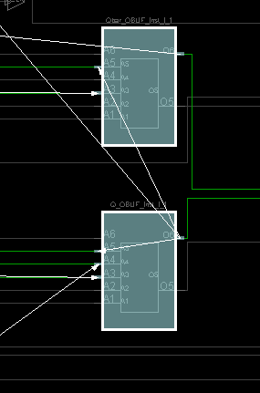

## 5 Latches and Flip Flops

Create these labs. Just do an RTL-schematic screen shot and something interesting device screen shot. Test them.  Copy all the bit files to a single folder so they can be demonstrated quickly all at once. 

The text associated with them is a pdf called Lab5. Figure out what points the text is making and create prompts in your lab notebook for yourself.

Lab5_1_1 is working. 
Labs 5_1_2 and 5_1_3 have a  file called "lab5_prehook". But the single line in this file in the xdc file. 

The major take away from this lab is using the tb_bench and understanding what a synchronous reset is. In the future we are going to be letting Vivado choose when to use a flip flop, not directly using them. 

------

# **Lab 5_101**

### **RTL Schematic:**

### Verilog Code:

### Something Interesting During Implementation:

### **Testing:**

The circuit has two inputs of S and R and two outputs of Q and Q'. The following table describes the behavior which the inputs make the outputs to follow in this SR latch: (Latch means no change!)

01 is reset, 10 is set, and 00 is illogical result... 

### Simulation Behavior:

# Lab 5_102

### RTL Schematic:

### Something Interesting During Implementation:

### Testing:

There are three inputs of S,R, and Enable. The Enable is mainly to turn on the circuit processing. S responds to Q and R responds to Q' outputs when turned on with Enable. Both together will result in no result b/c of it being illogical and  none on will result in a remember state where the circuit stays on the output shown from before.

### Verilog Code:

### Simulation Behavior:

As it is shown, both of the graphs from lab 101 and 102 are the same meaning that with or without switch, there is not much difference in the behavior. As shown, the Q, Q' are red at the start showing the delay of the circuit to the point of 30ns to give out an output, I think.

# Lab 5_103

### RTL Schematic:

### Something Interesting During Implementation:

### Testing:

There are two inputs of D and Enable. There are also two outputs of Q and Q' corresponding to the inputs. The behavior of the D-ff will look something like this:

​                                  

### Verilog Code:

# Lab 5-201

### RTL Schematic:

### Synthesis:

### Something Interesting During Implementation:

### Verilog Code:

### Testing:

There are two inputs of Clk and D which represent a D-ff with only one output of Q. The LED Q will turn on only if the clock is switched on after the D switch is on. When D switch is down, clock will turn the Q off if switched on.

### Simulation Behavior:

The red spot at the start may present the time that it takes for output Q to catch up with the inputs.

# Lab 5-202

### RTL Schematic:

### Something Interesting During Implementation:

Showing the three output reg shown above.

### Verilog Code:

### Testing:

Circuit has two inputs of D and Clock same as before. Outputs are Qa, Qb, and Qc which are individually changed by the switch of the D and Clock accordingly. Qa will turn on when D and Clock are on, Qb will turn on when D and Clock are on but then D is turned off. Qc will turn on when D and Clock are on, and D stays on but clock is turned off. Same as the following behavior:

# Lab 5-203

### RTL Schematic:

### Something Interesting During Implementation:

### Verilog Code:

### Testing:

The Q output will turn on when the two inputs of D and Clk are turned on and turns off when reset is on and Clk is turned off and on again (To register the synchronous reset). The circuit follows the behavioral table below:

# Lab 5-204

### RTL Schematic:

### Something Interesting During Implementation:

### Verilog Code:

### Testing:

There are 4 inputs: CLK,D, ce, and reset. Reset mainly resets the process with change of a clock. D and Clk act as the ones that turn on Q output and **CE enables the clock to function normally** meaning without it, clock won't function at all. The behavior below shows in detail what the Q will be at each point:

# Lab 5-205

### RTL Schematic:

### Something Interesting During Implementation:

### Verilog Code:

### Testing:

There are three inputs of CLK, reset, and T with Q as the only register output. Based on code, when T and Clk are on, nothing will happen. However, when reset is turned on with Clk turning off and on, Q will be on, because it is toggled on and when T is off, with reset on, changing Clk won't turn off the Q. 

### Prompts

***Questions asked and answered in Journal concerning each part of the lab***