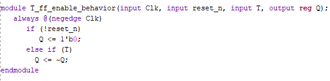

# Lab 6-Register

### RTL Schematic:

### Something Interesting About Implementation:

### Verilog:

### Testing:

There are 7 inputs, D[3:0] are mainly inputs to be stored by load when having any of them turned on with clk and load. The Q[3:0] outputs will turn on when the load is active with clock. It will turn off when reset is on and clock is switched off and on.

# Lab 6-102

### RTL Schematic:

### Something Interesting About Implementation:

### 

### Verilog:

### Testing:

There are 8 inputs which are controlled by clock. Set1 is to turn all the LEDs on no matter the D inputs, when the Clk is off and on. Load will allow the D inputs to be stored in any form using Clk. Reset will zero the entire process 

from start with the flip of the Clk. 

# Lab 6-103

### RTL Schematic:

### Something Interesting About Implementation:

### Verilog:

### Behavior:

### Testing:

As shown above, the inputs are Clk and ShiftIn and while ShiftIn is on, Clk needs to be switched off and on 3 times for ShiftOut output to turn on and similarly 3 times of clock ticks to turn it off.

# Lab 6-104

### RTL Schematic:

### Something Interesting About Implementation:

### Verilog:

### Behavior:

### Testing:

There are a lot of inputs which each do different jobs. They all will be working with constant tick of a clock, so it won't be mentioned below. 

Load will load values of ParallelIn into the RegContent. The contents then will make different combinations when turning both ShiftIn and ShiftEnb on and constantly moving ticks of clock. Then to reset, turning the ShiftEnb on only, with 

clock ticks will turn off all LEDs. Otherwise, ShiftIn will enable the LEDs to turn on form right to left one by one. If turned off midway, ShiftEnb can move the on lights to the left by one space until off.

# Lab 6-105

### RTL Schematic:

### Something Interesting About Implementation:

### Verilog:

### 

### Testing:

There are 3 inputs, Clk, ShiftIn, & ShiftEn. The two outputs are ShiftOut and [3:0] ParallelOut. The  circuit functions only when ShiftEnb is on, then, with ShiftIn on, each flip of Clk will turn on lights from right to left until the last one which also turns on ShiftOut. Then, nothing will happen until ShiftIn is off and Clk is flipped on and off again to off the lights one by one.

# Lab 6-201

### RTL Schematic:

### Something Interesting About Implementation:

### Verilog:

### Behavior:

### Testing:

There are 3 inputs; Clear_n,Enable, and Clock. Outputs are [7:0] Q and will turn on with the process below:

Nothing works without Enable, thus when on, Clear_n can be turned on and with flips of Clock, count up the binary numbers until 8 bit binary. It will reset when Clear_n is off and Clock is flipped on and off.

# Lab 6-202

### RTL Schematic:

### Something Interesting About Implementation:

### Verilog:

### Behavior:

### Testing:

The process is exactly the same as the circuit before with 8bit counter T-FF with the difference that LEDs turn on when Clock is on. 

# Lab 6-203

### RTL Schematic:

### Something Interesting About Implementation:

### Verilog:

### Behavior:

### Testing:

There are 4 inputs of Clock, Clear, Load, & Enable. The output is still [3:0]Q. The circuit won't work with Enable off. When on, flipping clock on and off will count down from "1010" mentioned in the code down to zero in binary. Once Clear is on, every LED will turn off with flip of clock. Load resets the counter from the start with Clock flip. 