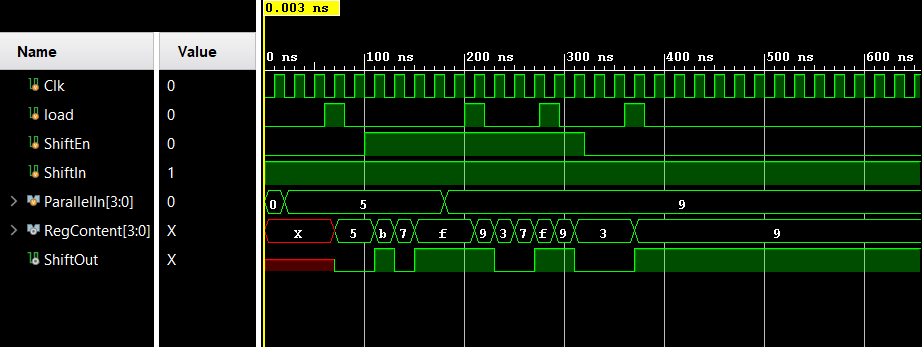

# Lab 6-Register

### RTL Schematic:

### Something Interesting About Implementation:

### Verilog:

### Testing:

There are 7 inputs, D[3:0] are mainly inputs to be stored by load when having any of them turned on with clk and load. The Q[3:0] outputs will turn on when the load is active with clock. It will turn off when reset is on and clock is switched off and on.

# Lab 6-102

### RTL Schematic:

### Something Interesting About Implementation:

### 

### Verilog:

### Testing:

There are 8 inputs which are controlled by clock. Set1 is to turn all the LEDs on no matter the D inputs, when the Clk is off and on. Load will allow the D inputs to be stored in any form using Clk. Reset will zero the entire process 

from start with the flip of the Clk. 

# Lab 6-103

### RTL Schematic:

### Something Interesting About Implementation:

### Verilog:

### Behavior:

### Testing:

As shown above, the inputs are Clk and ShiftIn and while ShiftIn is on, Clk needs to be switched off and on 3 times for ShiftOut output to turn on and similarly 3 times of clock ticks to turn it off.

# Lab 6-104

### RTL Schematic:

### Something Interesting About Implementation:

### Verilog:

### Behavior:

### Testing:

There are a lot of inputs which each do different jobs. They all will be working with constant tick of a clock, so it won't be mentioned below. 

Load will load values of ParallelIn into the RegContent. The contents then will make different combinations when turning both ShiftIn and ShiftEnb on and constantly moving ticks of clock. Then to reset, turning the ShiftEnb on only, with 

clock ticks will turn off all LEDs. Otherwise, ShiftIn will enable the LEDs to turn on form right to left one by one. If turned off midway, ShiftEnb can move the on lights to the left by one space until off.

# Lab 6-105

### RTL Schematic:

### Something Interesting About Implementation:

### Verilog:

### Behavior:

### Testing: