[For Loop Pipelining example](https://www.xilinx.com/support/documentation/sw_manuals/xilinx2015_2/sdsoc_doc/topics/calling-coding-guidelines/concept_pipelining_loop_unrolling.html)

# Lab 7-101

### Verilog Tb:

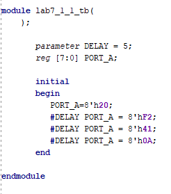

### Behavior:

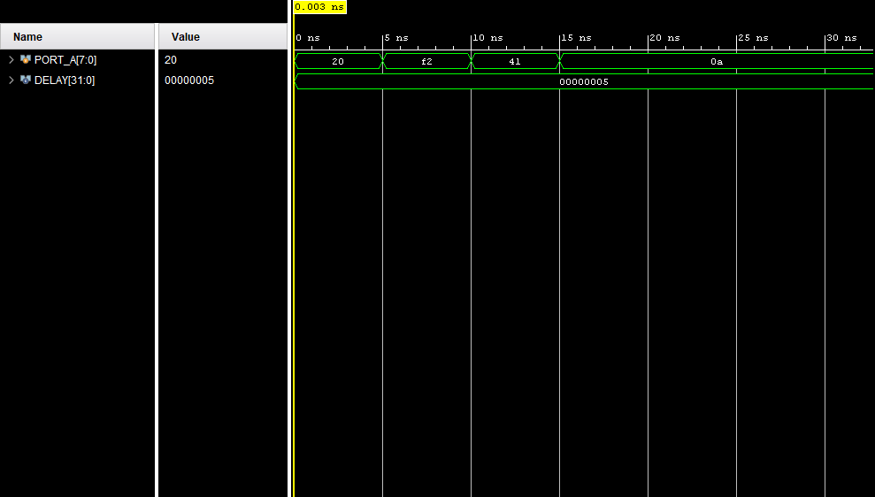

### Test:

According to the code, at the start, the value is 20, while since DELAY=5, with each flip until the fifth time,  value keeps changing until after the 15th unit, value becomes zero until the end. 

Purpose: Learning how delayed control procedural statement works. 

# Lab 7-102:

### Verilog Tb:

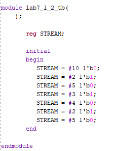

### Behavior:

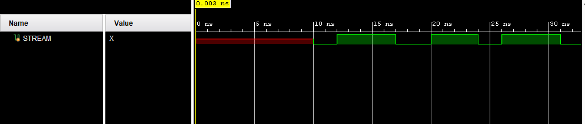

### Test:

The following again shows what is going on in the code with the difference of there being binary numbers and a good waveform but only beginning from 10th step since there was no initial value was given before to STREAM.

Purpose = Learning the difference between delayed control & intra_statement.

# Lab 7-103

### RTL Schematic:

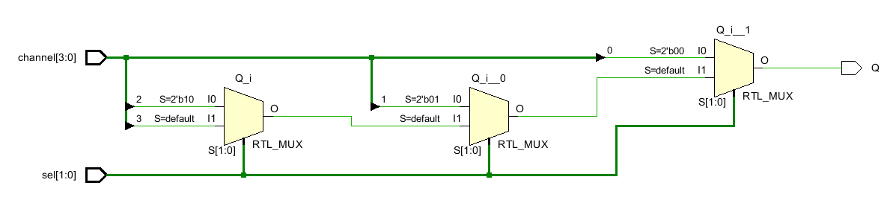

### Something Interesting About Implementation:

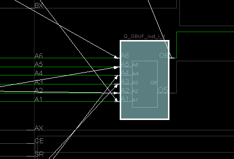

### Verilog (w/ Tb):

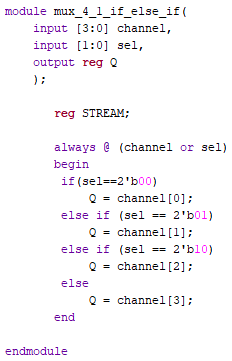

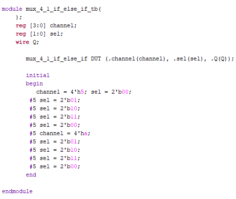

### Behavior:

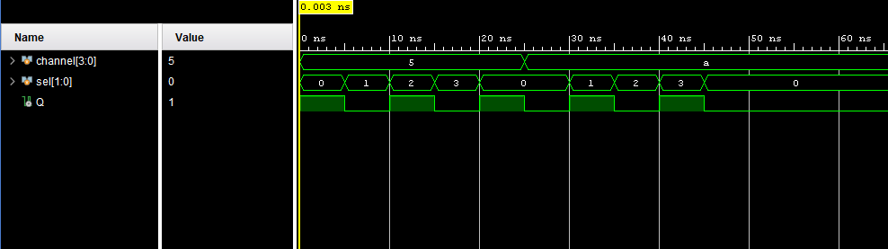

### Testing:

For verilog, there are two inputs [3:0] channel, and [1:0] sel. Output being Q will turn on based on the code but also by the Tb shown in waveform above. After each 5 units, the sel will change to different binary values, while channel won't change until 25th step and then until end won't change. Q will at some points turn on.

Purpose: Learning If/else conditions and how to compare code to test bench.

# Lab 7-104

### RTL Schematic:

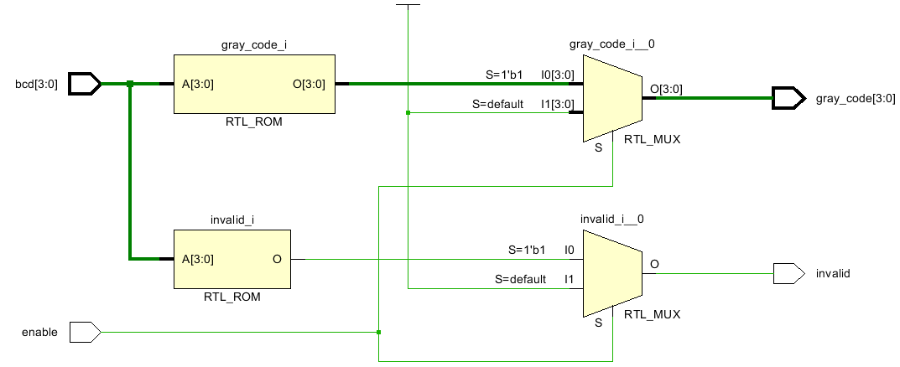

### Something Interesting About Implementation:

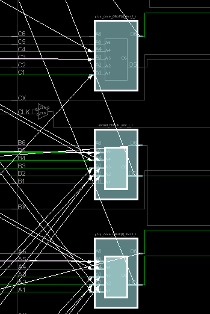

### Verilog:

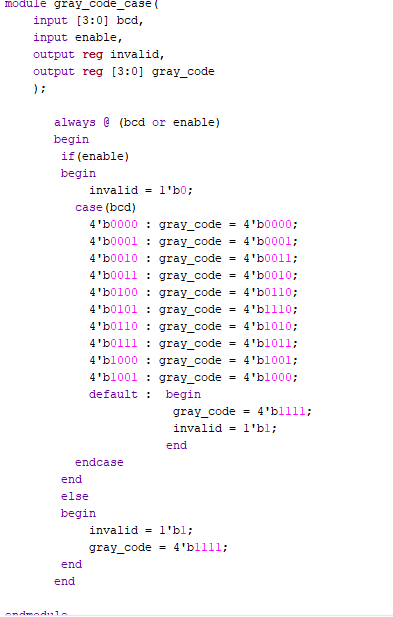

### Testing:

There are two inputs of bcd and enable which according to code, when bcd is on, all lights are on and nothing will happen as it should without enable. However, when enable is turned on, all LEDs as well as invalid will turn off. Then, based on changing the bcd switches, gray-code LEDs will respond to the corresponding input.

Purpose = Learning what a gray code is and its corresponding outputs.

# Lab 7-105

### RTL Schematic:

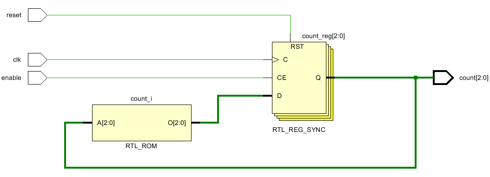

### Something Interesting About Implementation:

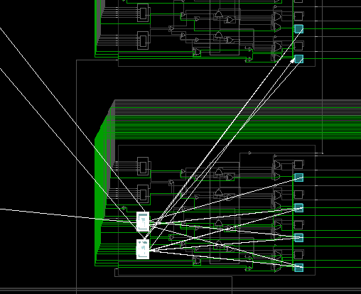

### Verilog(w/Tb):

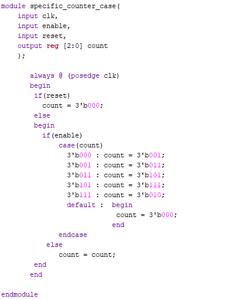

### Test Bench:

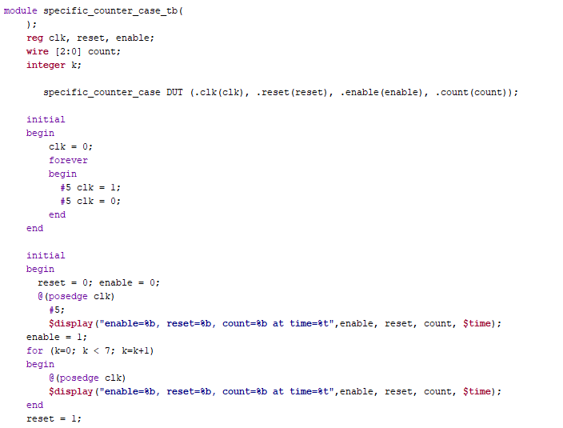

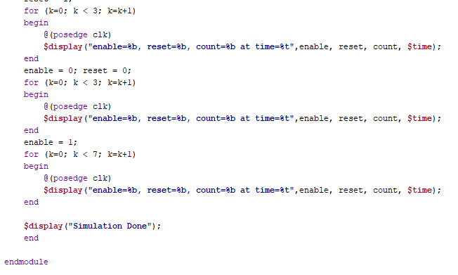

### Behavior:

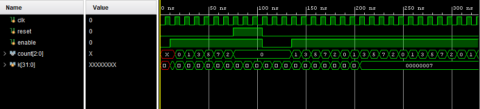

### Test Bench $Display:

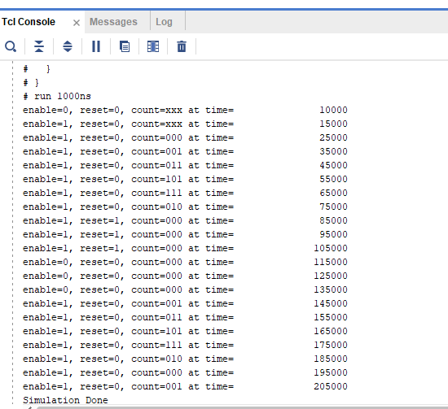

### Testing:

There are 3 inputs, Clk, reset, enable as well as [2:0] counter for output. The code uses a combination of if/else and case statements which follows the set given in question 000, 001,011,101,111,010 for each of the clock flips when enable is on. As usual, reset restarts the process from nothing. 

Purpose: Learning where $display is located, how to make a condition statement counter, how to change the output to what is needed.