# Lab 8-101

### RTL Analysis:

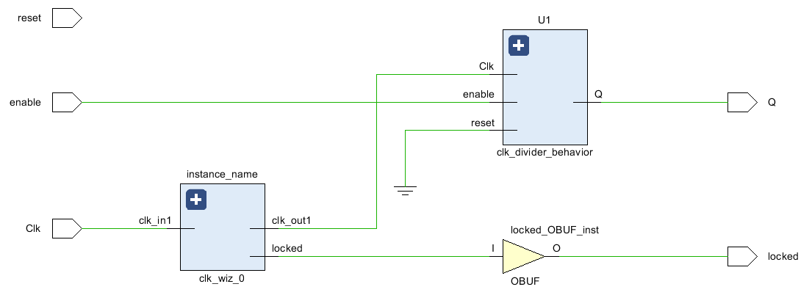

### Something interesting in implement:

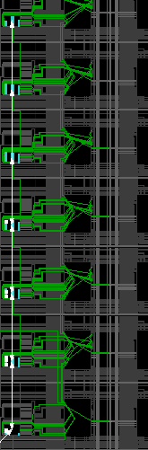

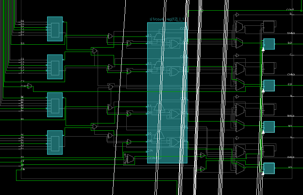

### Verilog Codes:

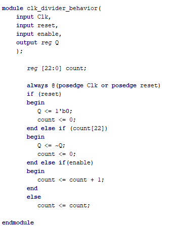

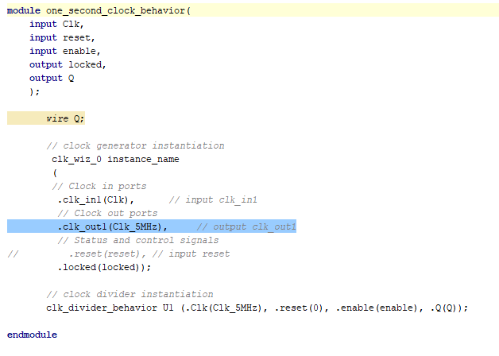

### Test:

There are 3 inputs of Clk, reset, and enable as well as 2 outputs of locked and Q. Locked and reset currently have no use and the only input is enable activating the Clk signal to be on per each 1 second. When off, signal will stop at current position.

Clock signal Wizard is a very helpful source of finding the necessary time for Clock to change and basically constructing my own clock.

# Lab 8-102

### RTL Analysis:

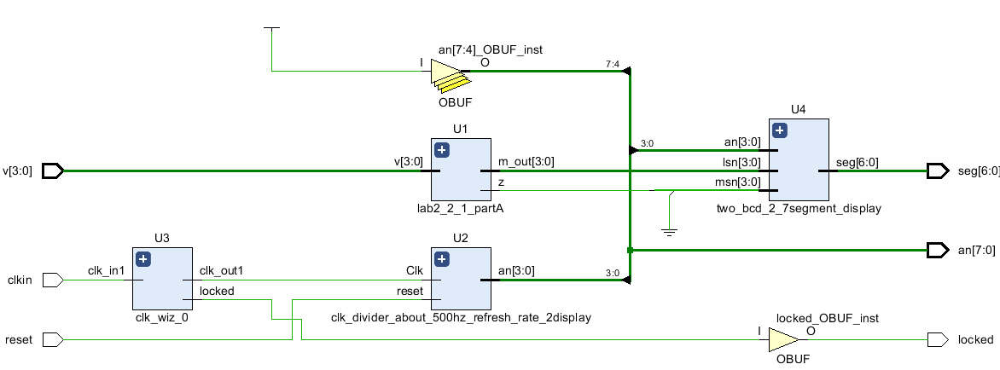

### Something interesting in implement:

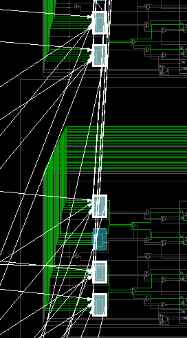

### Verilog Codes:

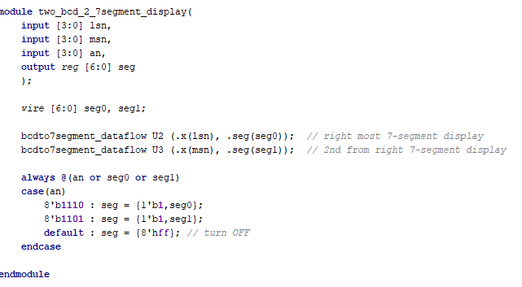

### Test:

There are 5 inputs of V[3:0] & reset. The outputs are the 7 segment display composed of 7 seg and 4 anodes. The switch of inputs goes in the order of binary digits for 4 digits which make up a hex value of up to 15. Locked still doesn't do anything to the circuit and the 100MHz Clock signal is divided in the outputs for the quick response time on the displays.

# Lab 8-201

### RTL Analysis:

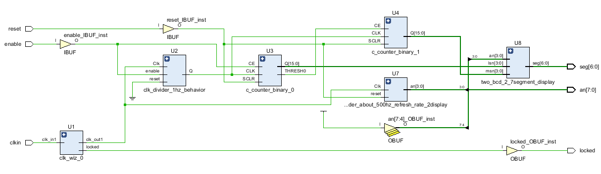

### Something interesting about implement:

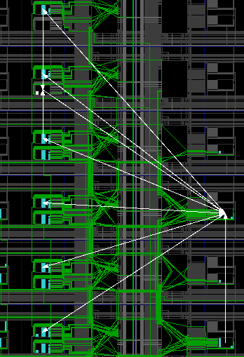

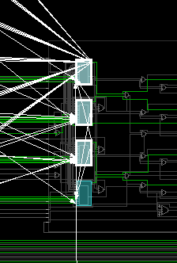

### Verilog Snippet:

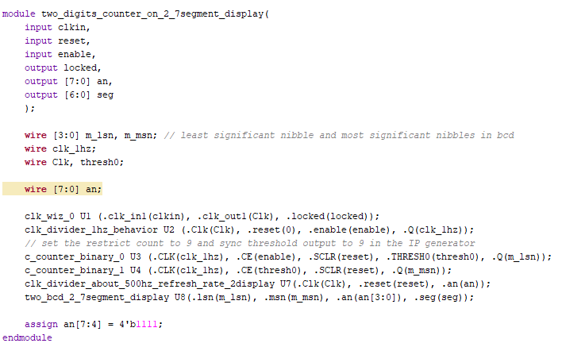

### Test:

The inputs are only reset and enable. Clock is there as a signal activated only when enable is on. Reset turns the counter value on 7 seg display(output) to '00' when the enable is on. It is designed to count up to 99 because both values are set to 9 and when right digit gets close to 10, the second digit takes it to turn that to 0 and changes itself to one value higher. The program  uses the catalog of FPGA in vivado for 5MHz clock and two binary counters set to Threshold of 9 and Final Count Value of 9. 

500MHz signal turns into 1Hz to be more accurate while displaying the digits over each second. 2 of the anodes in the code are used only for the 2 digits being displayed on the circuit.