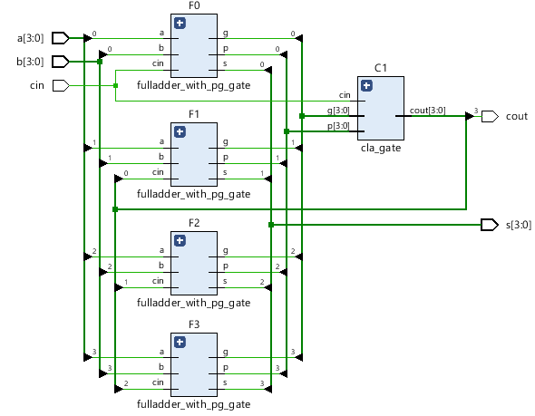
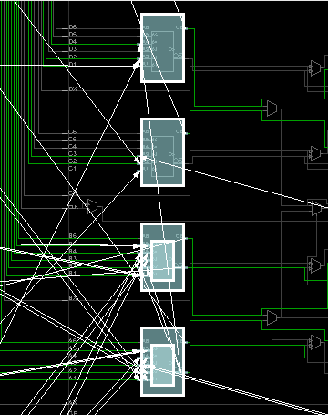
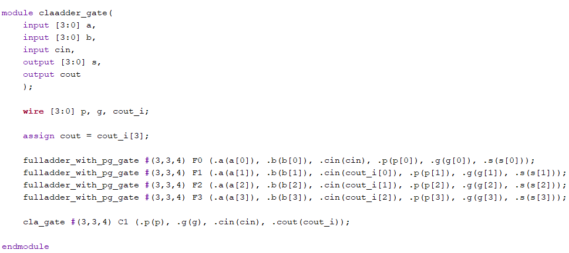
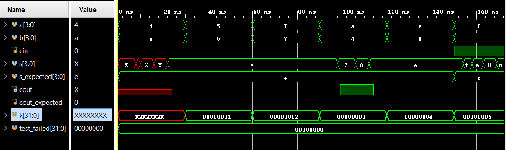
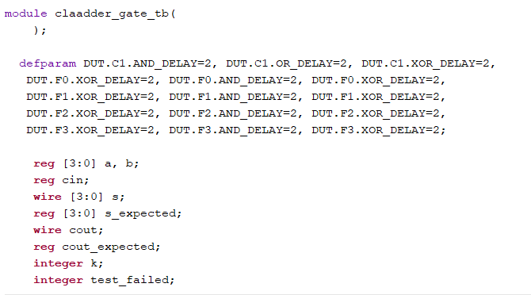
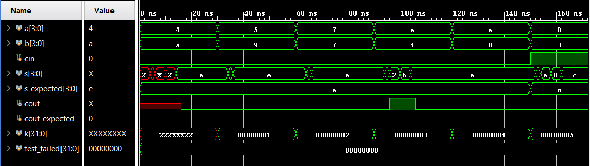
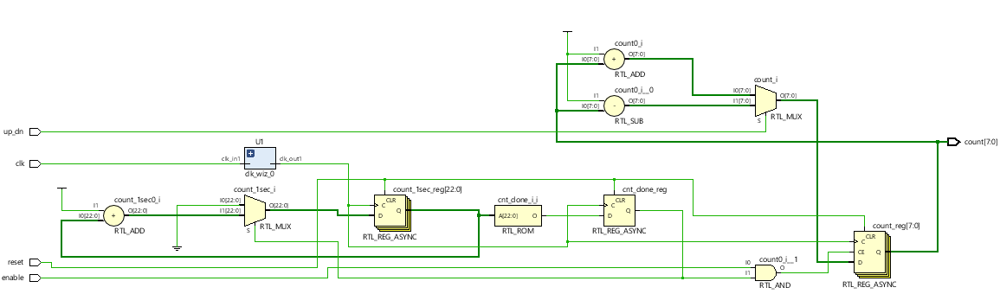
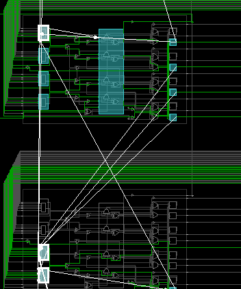
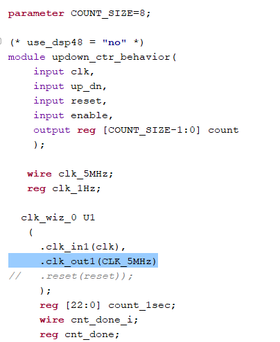

# Lab 9-101(Carry Look Ahead Adder)

### RTL Schematic:

### Something interesting in implementation:

### Verilog Code:

Verilog Top Module:

### Behavior:

### Testing:

There are inputs a[3:0] and b[3:0] which will be controlled by user and turned off and on. They can be added together as the role of each being a set of 4 binary digits. Output is s[3:0] which will turn on for only 4 binary value limit. When limit is reached, cout output will turn on showing the addition is added  to carry. cin will add 1 bit to the hex value of what the binary result is. There is a 2 unit of delay to each gate for the adder modules given as the parameter value. The top module changes the delay values based on instantiation method discussed for parameters i.e. #(3,3,4) for gates in order. Delays are visible in behavior model above.

# Lab 9-102(Carry Lookahead Adder w/ defparam)

### RTL Schematic:

### Something interesting in implementation:

### Verilog Code:

Bit of Test Bench code with defparam program:

### Behavior:

### Testing:

Follows the same principle as above circuit but now with defparam used for instantiation assignments to the parameter values. All data seems to follow the same program.

# Lab 9-201(8Bit Counter)

### RTL Schematic:

### Something interesting in implementation:

### Verilog Code:

Snippet of where the necessary "no" to dsp48 slices is used:

### Testing:

There are two inputs of Enable and Up_Dn which in order, enable the counter and if Up_Dn is off, will count down and vice versa. The clock is set to 5MHz for the output and reset is used to clear the whole process. count[7:0] is the output which will light up with enable on. 

# Lab 9-202()

### 

### 

### 

### 