# Lab 9-101(Carry Look Ahead Adder)

### RTL Schematic:

### Something interesting in implementation:

### Verilog Code:

Verilog Top Module:

### Behavior:

### Testing:

There are inputs a[3:0] and b[3:0] which will be controlled by user and turned off and on. They can be added together as the role of each being a set of 4 binary digits. Output is s[3:0] which will turn on for only 4 binary value limit. When limit is reached, cout output will turn on showing the addition is added  to carry. cin will add 1 bit to the hex value of what the binary result is. There is a 2 unit of delay to each gate for the adder modules given as the parameter value. The top module changes the delay values based on instantiation method discussed for parameters i.e. #(3,3,4) for gates in order. Delays are visible in behavior model above.

# Lab 9-102(Carry Lookahead Adder w/ defparam)

### RTL Schematic:

### Something interesting in implementation:

### Verilog Code:

Bit of Test Bench code with defparam program:

### Behavior:

### Testing:

Follows the same principle as above circuit but now with defparam used for instantiation assignments to the parameter values. All data seems to follow the same program.

# Lab 9-201(8Bit Counter)

### RTL Schematic:

### Something interesting in implementation:

### Verilog Code:

Snippet of where the necessary "no" to dsp48 slices is used:

### Testing:

There are two inputs of Enable and Up_Dn which in order, enable the counter and if Up_Dn is off, will count down and vice versa. The clock is set to 5MHz for the output and reset is used to clear the whole process. count[7:0] is the output which will light up with enable on. 

# Lab 9-202(8Bit Counter w/dsp48 slices)

### RTL Schematic:

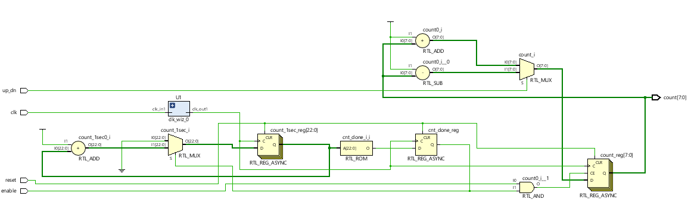

### Something interesting in implementation:

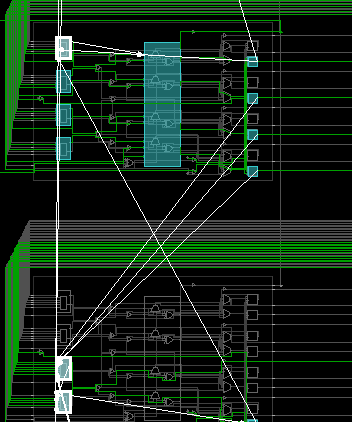

### Verilog Code:

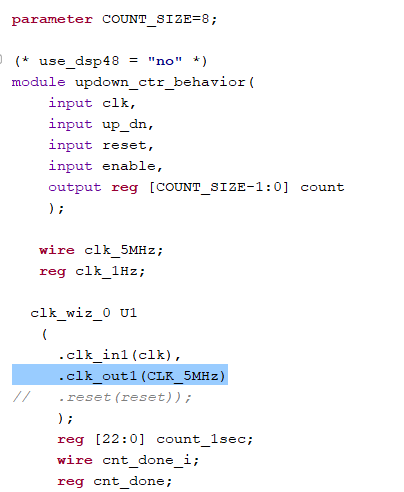

### Testing:

Everything seems to be the same except now the circuit uses dsp48 slices to perform the program because forcing it is allowed. # of BUFG/BUFGCTRL:(from implementation design) 2, # of Slice LUTs:27, # of FFs: 25, # of DSP48E1 Slices: 2, # of IOs: 12. 

# Lab 9-203(8Bit Counter w/ Core Generation)

### RTL Schematic:

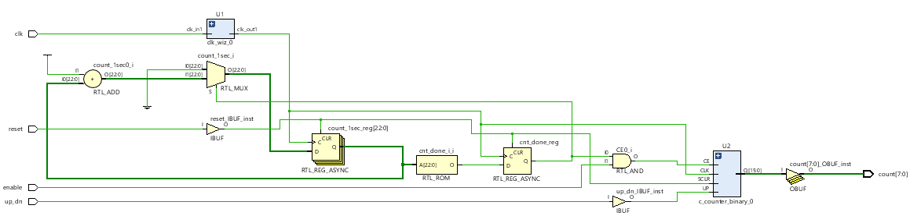

### Something interesting in implementation:

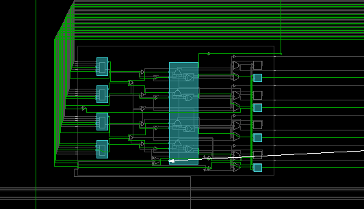

### Verilog Code:

Snippet of code from counter generator (Fabric)

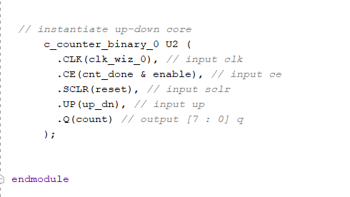

### Testing:

Effectively, it runs the same code but now with a Xilinx made generator and clock wizard which take control of the counting and division of clock signals. No dsp48 is used for this code because of the generator. # of BUFG/BUFGCTRL:(from implementation design) 2, # of Slice LUTs:38, # of FFs: 32, # of DSP48E1 Slices: 0, # of IOs: 12.

# Lab 9-204(8Bit Counter w/ Core Gen & Dsp48)

### RTL Schematic:

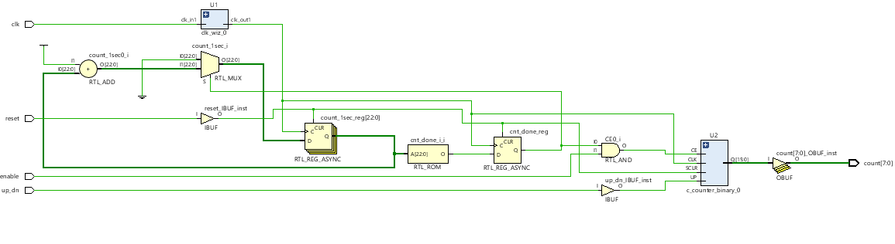

### Something interesting in implementation:

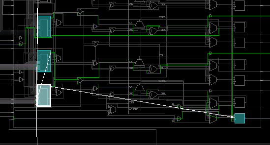

### Verilog Code:

(Same snippet as above, interestingly enough the dsp48 is not seen in the code but in background)

### Testing:

As mentioned before, the program display will be the same, however, the code will change for Core Generator from IP Catalog to use DSP48 Slices for its counter. This time therefore, there will be dsp48 slices in implementation. # of BUFG/BUFGCTRL:(from implementation design) 2, # of Slice LUTs:29, # of FFs: 24, # of DSP48E1 Slices: 1, # of IOs: 12.

# Lab 9-301(Stop-Watch Timer)

### RTL Schematic:

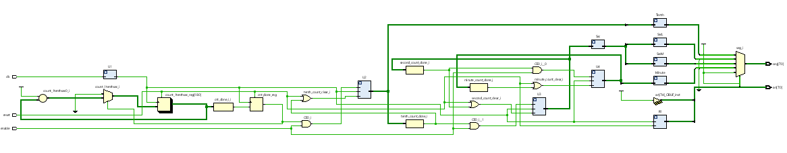

### Something interesting in implementation:

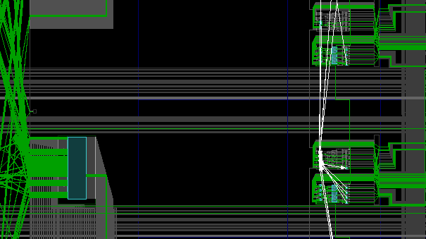

### Verilog Code:

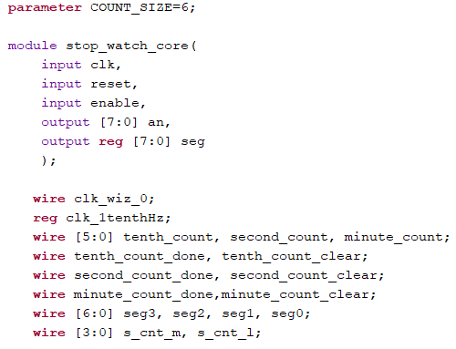

### Testing:

The circuit's input is enable and once on, it will start from tenth of a second and go up to a minute on the 7seg display. Only 4 Digits of 7seg display are used and the clock is at 5MHz for each signal through the output. To reset, BTNU button is pressed and it starts again from 0.00.0. The dots in between represent the anodes which also are there to represent the real time seconds up to each minute. After 60 sec is reached, it will move up to add one to minute_count. There is a loop meaning when minute reaches 10, the process will start again from 0.00.0. The above code is a representation of wires being named for each function that the program blocks do and take in. 

# Lab 9-302(Count-Down Timer)

### RTL Schematic:

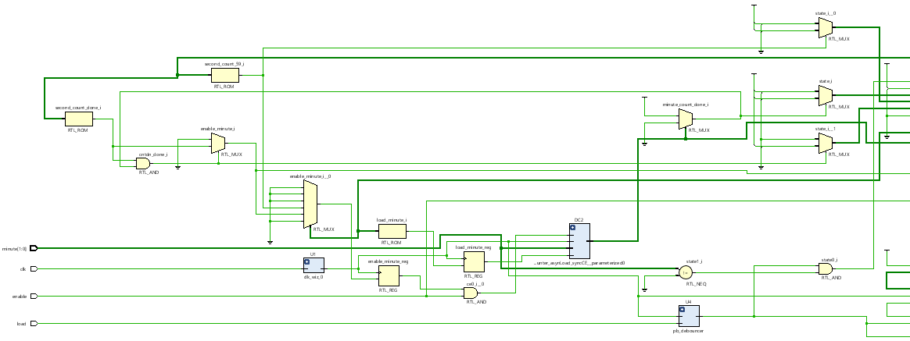

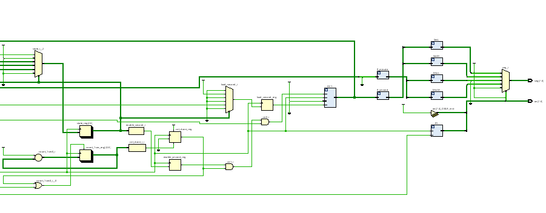

### Something interesting in implementation:

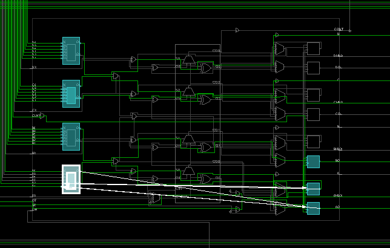

### Verilog Code:

A small portion of what the inputs and outputs of top module are and where the parameter is specified:

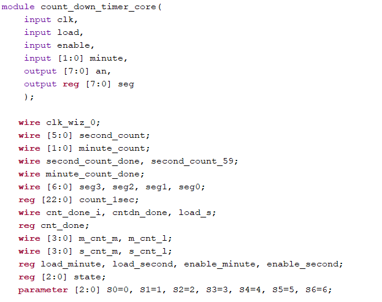

### Testing:

The inputs are enable, load, and minute [1:0]. When enable is on, the clock will be active to work but first needs to be started by choosing one of inputs minute[1:0]. When one is turned on, load button on M18 will need to be pressed and held for a couple of seconds until the process of counting down starts. Minute[0] starts a count down from 1 min and minute[1] starts from 2 minutes. Then if enable is off, clock will stop and will continue when enable is back on. The clock signal is 5MHz and the seconds and minute will go off based on real time timers. 

# Lab 9-303(Clock)

### RTL Schematic:

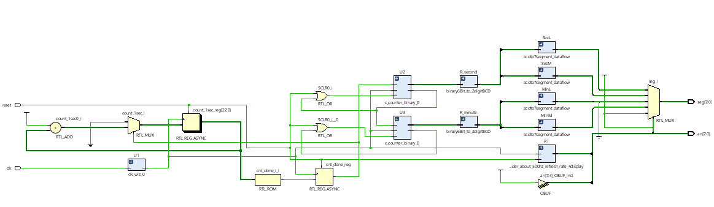

### Something interesting in implementation:

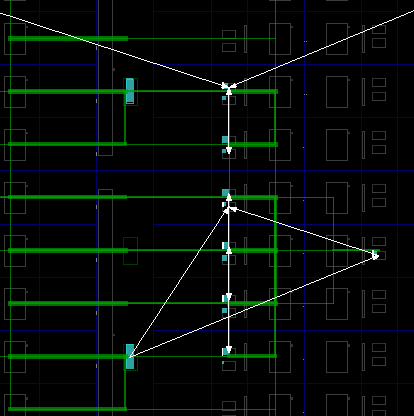

### Verilog Code:

The top module inputs and outputs and parameter being equal to 6

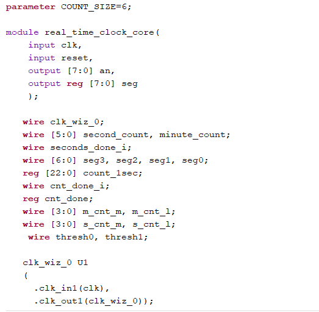

### Testing:

Since this is a real time clock, there is no input but the reset. It will start to count up from the seconds and go up to 60, then reset back to 00 and minute will change to 1. This will continue until minute is 60 and then everything resets back to 0 due to the program of Thresh0 in counter core generated. This program is much more sophisticated compared to the last one due to an already made design doing most of the work of counting. In last program, there was no counter core, thus everything had to be put into perspective such as the data output for what happens at each second and each minute. The following uses dsp48 slices for the addition process and has CE and SCLR which is the reset button at M18. Outputs are the 7seg display which continue to change and increase in value. Clock wiz is here to divide the output clock signal to 5MHz for the output to the circuit to be slow but accurate.

